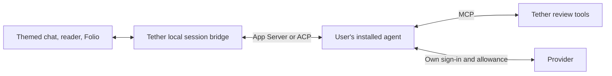

# A themed agent chat inside Tether

Researched 2026-09-20. Companion to [[platform-research-2026-09-20.md|Platform and audience research]]. Documentation review only; no custom client was built or tested.

**Yes: Tether could replace terminal chat with its own browser interface while keeping an existing subscribed coding agent underneath.** Codex offers the clearest documented integration. Claude Code also has a plausible route, with narrower authentication/distribution conditions and changing billing policy. This would add an agent client to Tether, beyond adapting its Markdown reader.

| Route | Subscription and implementation assessment |
| --- | --- |
| **Codex App Server** | Explicitly intended for integration into other products; exposes authentication, history, streaming, approvals, and usage-limit reporting. Codex manages ChatGPT sign-in and refresh. Use its supported stdio interface behind Tether’s local service; the TCP WebSocket mode is marked experimental/unsupported. [App Server](https://learn.chatgpt.com/docs/app-server) |
| **Unmodified Claude Code subprocess** | Streamed JSON and session continuation provide a technical starting point. Anthropic permits running the unmodified binary inside products under its Commercial Terms, preserving all built-in authentication options and direct end-user billing. Keep sign-in inside Claude’s own flow. [Programmatic interface](https://code.claude.com/docs/en/headless), [distribution/authentication conditions](https://code.claude.com/docs/en/legal-and-compliance) |
| **Agent Client Protocol (ACP)** | A shared conversation/control protocol with streaming, permissions, cancellation, and optional session loading. Existing Codex and Claude adapters reduce duplicated work, but do not make authentication, billing, or capabilities uniform. [Protocol](https://agentclientprotocol.com/protocol/v1/overview) |
| **Theme an existing chat website** | A CSS/content-script extension could change typography while the vendor retains conversation and billing. This is a different, narrower offer: dependent on changing page structure, limited to that browser, and not a replacement interface for local agents. |

Codex distinguishes ChatGPT subscription authentication from separately billed API-key access. A local Tether client can use the former without routing requests through Tether-owned API billing; normal plan limits still apply. “Use your existing Codex allowance” is a defensible proposed offer, while “unlimited” or “every provider subscription” is not. Preserve the user’s configured provider and expose the active billing mode; never silently fall back to paid API access. [Authentication](https://learn.chatgpt.com/docs/auth), [usage limits](https://learn.chatgpt.com/docs/pricing)

**The Anthropic SDK surcharge premise needs updating.** Its June 16 support article begins with a June 15 reversal: the proposed separate SDK credit/billing change is paused, and Agent SDK, `claude -p`, and third-party app usage still draw on subscription limits for now. The older policy remains below the notice and can easily be mistaken for current policy. [Current notice](https://support.claude.com/en/articles/15036540-use-the-claude-agent-sdk-with-your-claude-plan)

Billing and distribution permission remain separate. Anthropic prohibits third-party collection/intermediation of Claude subscription credentials, while expressly allowing users to authenticate directly into an unmodified Claude Code binary hosted by another product. SDK guidance additionally requires prior approval to offer claude.ai login/rate limits in a third-party application. Prefer the original CLI with its own login; resolve the precise distribution classification before promising a public Claude integration. These sources establish a viable investigation, not blanket approval for every wrapper. [Claude Code conditions](https://code.claude.com/docs/en/legal-and-compliance), [SDK guidance](https://code.claude.com/docs/en/agent-sdk/overview)

There is a concrete compatibility risk: Claude’s documented `--bare` mode excludes subscription OAuth, and the docs say it will become the default for `-p`. Pin and test supported versions rather than assuming headless subscription behavior will remain unchanged. Its noninteractive mode also changes workspace-trust behavior; Tether would need an explicit trusted-workspace entry step. [Programmatic usage](https://code.claude.com/docs/en/headless)

The architectural fit is straightforward:

Tether owns presentation and document review; the existing agent retains its inference loop, configuration, and provider authentication. Keep provider tokens out of the browser. Agent execution needs a separate workspace grant: permission to read one Markdown document must not silently become permission to execute commands across its repository.

The current [Codex ACP adapter](https://github.com/agentclientprotocol/codex-acp) wraps App Server and documents ChatGPT login; the [Claude ACP adapter](https://github.com/agentclientprotocol/claude-agent-acp) wraps the Agent SDK, so adopting it does not avoid the SDK policy question. [Zed’s external-agent support](https://zed.dev/docs/ai/external-agents) is an existing example of a custom UI around external agents. Start with direct Codex App Server for the smallest single-provider experiment; evaluate ACP when adding a second supported agent.

The substantial work is interaction state: partial messages, tool progress/results, approvals and questions, cancellation, reconnect without duplicate execution, session restoration, and readable errors/limits. Reuse Tether’s typography, themes, layout, and document components; do not force a live transcript into the editable Markdown-body model. Session loading is optional in ACP, and common transport does not preserve hidden conversation state when switching agents. [ACP lifecycle](https://agentclientprotocol.com/protocol/v1/overview)

Do not promise an alternative frontend for all of ChatGPT or Claude: coding-agent access does not automatically reproduce their consumer chat histories, memory, projects, voice, or every model. Claude already offers an official browser view of a local coding session through Remote Control, which is a useful comparison but does not expose a documented Tether replacement-UI contract. [Remote Control](https://code.claude.com/docs/en/remote-control)

**Recommendation:** keep this separate from the next reader-adapter release. After the review pilot, test one local Codex session with Tether’s reading theme, a composer, visible tool/approval states, stop/resume, and a linked review document. Success means the same user can complete a real document-review exchange comfortably, reconnect reliably, and stay on their existing allowance. Measure whether integrated chat improves on reader-plus-existing-agent enough to justify maintaining an agent client; do not begin with a universal chat product or a new desktop shell.
