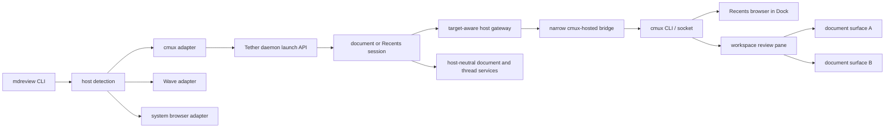

# Tether cmux adapter design brief

**Status:** implemented and validated\
**Research date:** 2026-09-01; implementation validated 2026-09-03\
**Local reference build:** cmux 0.64.22 (102), commit `ddd4a01bc`

## Executive recommendation

Build the cmux adapter around two native cmux surfaces:

1. Put **Tether Recents in the right-sidebar Dock** as a browser surface. This is the closest cmux analogue to Wave's widget collection and keeps artifact discovery visible without consuming a main workspace pane.
2. Put **documents in one review pane** to the right of the invoking terminal. Reuse that pane through live cmux inspection when possible, opening additional Tether documents as browser surfaces—tabs—rather than persisting layout memory in the first build.

Do not build a second Recents UI, replace Vault, depend on Canvas, or override cmux's built-in Markdown viewer in the first pass. Tether's existing Recents page and editor already fit cmux's browser surfaces.

The main technical constraint is cmux socket authorization. Exact-build inspection and live testing established that cmux 0.64.22 injects a signed `CMUX_SOCKET_CAPABILITY` into terminal processes specifically so inherited descendants remain authorized after detachment and reparenting. Tether therefore launches a narrow detached bridge that retains this capability only in process memory and exposes only authenticated Tether view-placement operations to the daemon. The bridge, its health record, and every callback are bound to the exact cmux build, socket fingerprint, and daemon instance. cmux's broader `automation` mode remains a later opt-in named **Direct cmux control (broad local access)**, not the default.

## Desired experience

### Direct document open

```text
terminal: mdreview open plan.md
                 │
                 ▼
┌──────────────────────────────┬──────────────────────────┐
│ agent / shell                │ Tether review pane       │
│                              │ ┌──────────────────────┐ │
│ remains available            │ │ plan.md              │ │
│                              │ └──────────────────────┘ │
└──────────────────────────────┴──────────────────────────┘
```

The view appears beside the invoking terminal without replacing it. On later opens, Tether derives the review pane from live cmux state and adds another browser tab when reliable discovery succeeds. The first build does not persist a layout registry.

### Recents discovery

```text
┌────────────────────────────────────────────────┬──────────────────┐
│ active workspace                               │ cmux right Dock  │
│                                                │                  │
│ terminal              Tether document pane     │ Tether Recents   │
│ ┌──────────────┐      ┌─────────────────────┐  │ ┌──────────────┐ │
│ │ agent        │      │ artifact.md         │  │ │ recent A     │ │
│ │              │      │                     │  │ │ recent B     │ │
│ └──────────────┘      └─────────────────────┘  │ │ recent C     │ │
│                                                │ └──────────────┘ │
└────────────────────────────────────────────────┴──────────────────┘
```

The first `mdreview recents` call creates a dedicated Tether browser tab in the Dock; later calls reveal and select that retained tab. Selecting a document opens it in the originating workspace's review pane while Recents remains available. The Dock is already a full cmux pane container in 0.64.22, supports browser surfaces, and persists with cmux session state.

### Attention behavior

* Direct CLI opens and user-clicked Recents or wikilinks focus the resulting document by default.
* Background or agent-triggered opens use `focus: false`.
* Support `--focus` and `--no-focus` from the beginning so callers can override the default.
* Keep one review pane per workspace when live cmux inspection can identify it reliably.
* Preserve the source view when opening wikilinks or Recents entries.
* If the review pane was closed, recreate it beside the originating surface.
* If the original surface no longer exists during an explicit human-triggered open, fall back to the currently focused pane. For background or agent-triggered opens, return `placement_anchor_missing` rather than placing the view in a possibly unrelated context.
* Never substitute the system browser for a requested cmux placement.

## Why this shape fits cmux

cmux's useful hierarchy is:

```text
Window
└── Workspace
    └── Pane            split region
        └── Surface     tab within a pane
            └── Panel   terminal or browser content
```

Tether should map to that hierarchy rather than emulate Wave blocks:

| Tether concept         | cmux representation                        |
| ---------------------- | ------------------------------------------ |
| Recents queue          | browser surface in the right-sidebar Dock  |
| review area            | one pane in the originating workspace      |
| open document          | browser surface in the review pane         |
| multiple documents     | multiple surfaces in the same review pane  |
| linked document        | new surface; source surface remains open   |

This layout keeps the conversational and artifact contexts simultaneously visible without introducing a separate Tether workspace.

## Capability audit

The table distinguishes behavior verified from the installed 0.64.22 binary or its exact source commit from features visible only in moving documentation.

| Capability                  | Evidence                                                              | cmux 0.64.22 finding                                                                             | Tether decision                                                                         |
| --------------------------- | --------------------------------------------------------------------- | ------------------------------------------------------------------------------------------------ | --------------------------------------------------------------------------------------- |
| Detect host context         | installed CLI help                                                    | `CMUX_WORKSPACE_ID`, `CMUX_SURFACE_ID`, and `CMUX_SOCKET_PATH` are supplied in cmux terminals    | detect cmux from its context and binary; report socket readiness separately             |
| Create browser split        | installed CLI help                                                    | `new-pane --type browser --direction right --url ...`                                            | candidate first-document placement; verify exact surface anchoring                      |
| Add browser tab             | installed CLI help                                                    | `new-surface --type browser --pane ... --url ...`                                                | reuse a live-discovered workspace review pane                                            |
| Target workspace            | installed CLI help                                                    | creation commands accept `--workspace`; caller workspace is the default                          | always pass the captured workspace explicitly                                           |
| Target source surface       | exact-commit RPC source and live verification                         | `pane.create` accepts exact window, workspace, and source-surface UUIDs                          | anchor first-document placement to the captured invoking surface                        |
| Control focus               | installed CLI help                                                    | creation commands accept `--focus true|false`                                                    | carry focus on each open request                                                        |
| Right-sidebar browser       | installed CLI help and exact-commit Dock docs                         | `--placement dock` supports browser panes and surfaces                                           | lazily create, retain, reveal, and select one Recents tab                                |
| Return created handles      | exact-commit Dock docs and live verification                          | creation responses return pane/surface handles; Dock uses `dock_pane_id` and `dock_surface_id`   | use operation results and live inspection; persist no layout registry                    |
| Session restore             | exact-commit Dock and session-restore docs                            | workspace and Dock browser state are restored                                                    | Phase 4 documents relaunch; durable in-place renewal belongs to Phase 4.5                |
| Socket API                  | installed CLI help and official API docs                              | CLI and newline-delimited JSON socket APIs are available                                         | use CLI argument arrays first; keep socket protocol behind adapter                      |
| Socket security             | exact-commit source and live detached-child verification              | a signed terminal capability remains valid after detachment and reparenting                      | retain it only in a narrow, exact-instance-bound bridge process                          |
| Same-user automation        | schema and issue-confirmed behavior; live verification pending        | `automation` removes ancestry checks and materially broadens same-user control                   | later **Direct cmux control (broad local access)** opt-in only                            |
| Command Palette actions     | exact-commit schema and issue-confirmed behavior                      | command actions run through terminal surfaces                                                    | defer until they can select the retained Dock tab without transient terminal UI         |
| Custom sidebars             | exact-commit docs                                                     | installed interpreted sidebars bind only to cmux-owned data and actions                          | cannot read live Tether Recents; do not use for Phase 4                                 |
| Custom right-sidebar panels | moving `main` docs, not installed contract                            | newer docs add a right-sidebar form                                                              | do not depend on it                                                                     |
| Dock                        | exact-commit docs and installed CLI help                              | persistent terminal/browser pane container                                                       | use its browser surface directly; no Recents TUI                                        |
| Vault                       | official docs                                                         | indexes and resumes supported agent transcripts                                                  | leave unchanged; artifacts are not agent sessions                                       |
| Terminal command-click      | installed schema and official docs                                    | HTTP links can open in cmux's browser; Markdown paths open cmux's viewer                         | ordinary links now; investigate an opt-in Tether Markdown handler after Phase 4         |
| File-extension hook         | official configuration docs                                           | no documented Tether-specific Markdown handler                                                   | report `fileNavigatorHook: false`                                                       |
| Canvas                      | official shortcut/changelog docs                                      | freeform layout exists but remains experimental                                                  | defer; tiled panes are the compatibility baseline                                       |
| Events                      | moving official event contract                                        | reconnectable workspace/pane/surface event stream exists                                         | optional later lifecycle reconciliation, not required for opening                       |

## Sidebar and launcher alternatives

### 1. Dock browser — recommended

The installed Dock can host the existing Tether Recents web page directly. It preserves all current Recents behavior, including search, context actions, and document launch. This is less code and higher fidelity than a TUI.

Constraints:

* Dock state is per cmux window/workspace scope, so the adapter must retain one immutable originating-workspace target when it creates the Recents session.
* The first explicit Recents open may displace Files, Vault, Feed, or another right-sidebar mode. Later calls reveal and select the retained Tether tab; background actions never switch the visible Dock tab.
* Lazily create one named Tether browser surface on first use, then keep and reuse it. Do not eagerly start it on every cmux launch or create a new Dock split on every open.
* A restored Recents URL is dead after the Tether daemon is stopped, replaced, or lost across reboot. Without a stable bootstrap origin, recovery requires rerunning `mdreview recents`; do not promise an in-page relaunch state in Phase 4.
* Narrow Dock widths may need one responsive CSS pass in the existing Recents page.

### 2. Interpreted custom sidebar — not presently viable

cmux's interpreted sidebars are visually attractive and inexpensive to distribute, but the installed runtime exposes cmux-owned workspace data—not arbitrary filesystem or HTTP data. It cannot directly consume Tether's registry or safely mint document launch sessions. Regenerating static sidebar source on every Recents change would still leave dynamic daemon origins and single-use launch tickets unsolved.

A future right-sidebar extension API with a scoped Tether data bridge could change this assessment. Phase 4 should not build around an API that is still moving.

### 3. Command Palette or hotkey — useful after the core flow

An `Open Tether Recents` action is desirable. The installed action system executes shell commands through a terminal target, so it can create a transient tab or write into the active terminal. That is not yet cleaner than running `mdreview recents` directly.

Add the action only after an experiment proves that it can reveal the Dock and select the retained Tether tab without focus bounce, a transient terminal, or a new Recents pane in the workspace. Do not claim a hotkey in the Phase 4 exit condition.

## Command-click assessment

cmux already routes terminal HTTP links into a nearby embedded browser and routes Markdown file paths to its own Markdown viewer. Phase 4 leaves those defaults intact.

Printing a Tether launch URL for command-click would be a regression:

* it exposes a short-lived, single-use ticket in terminal scrollback;
* ticket expiry makes the link unreliable;
* cmux, not Tether, chooses placement;
* it bypasses Tether's explicit path grant and host-target transaction;
* it adds a click where `mdreview open` can place the view directly.

Command-click remains useful for ordinary links inside agent output. It is not the initial Tether launcher contract. After Phase 4 has proven reliable, investigate an opt-in Markdown handler that atomically accepts a path, records it in Recents when absent, and opens it through Tether. Do not expose a launch ticket in terminal output to implement that flow.

## Proposed adapter architecture



### `CmuxHostAdapter`

Add `src/hosts/cmux.ts` with:

* exact version detection;
* cmux executable resolution from `PATH` and the application bundle;
* an allowlisted command environment;
* structured JSON parsing;
* `launchTarget()` containing only host, exact build identity, and immutable window/workspace/surface identifiers;
* `openView()` that uses or creates the workspace review pane;
* `openRecents()` or a placement hint that uses the Dock;
* system `open` and Finder reveal delegation through the existing browser adapter;
* no browser automation or DOM control.

Capture the target once per CLI operation and use the same object for ticket creation and opening. Obtain window identity through `cmux identify --json`; `CMUX_WINDOW_ID` is not a documented injected variable. Do not store socket passwords, launch tickets, document paths, or cmux credentials in the target.

### Target-aware gateway

The daemon's current gateway recognizes Wave targets and sends every other target to the system browser. Generalize it:

```text
wave target    → Wave bridge
cmux target    → cmux adapter
other target   → system browser
```

The existing server already carries `session.target` through document and Recents tickets, wikilink opens, and recent-document actions. The domain model and browser client do not need cmux imports.

### Narrow cmux bridge

Launch a detached, credential-isolated bridge from the invoking cmux terminal. cmux 0.64.22's signed socket capability is designed to survive inheritance, detachment, and reparenting, so no hidden terminal or Dock surface is required. The bridge keeps the capability only in its allowlisted process environment; discovery records store only a SHA-256 fingerprint of the normalized socket path.

The bridge:

* independently requires exact cmux version, build, and commit before spawn;
* binds its record and health contract to the cmux socket fingerprint and current Tether daemon instance;
* rechecks the exact cmux build at startup, on health requests, and before every callback placement;
* exposes an authenticated loopback API using Tether's existing control credential;
* accepts only validated Tether document and Recents placement requests plus health and stop;
* rejects non-loopback Tether URLs, stale targets, mismatched build identity, and arbitrary cmux commands;
* retains no document content or filesystem authority;
* serializes concurrent placement without persisting layout state;
* exits when the daemon identity changes or it is explicitly stopped.

A stale, mismatched, or unavailable bridge returns an explicit structured error. Tether never falls back to the system browser for a requested cmux placement.
### Live review-pane discovery

The first build keeps no layout registry. Before opening a document, inspect live cmux state for a Tether review pane in the target workspace. Reuse it when it can be identified unambiguously; otherwise create a new right split anchored to the captured source surface. Serialize placement per workspace within the running bridge so simultaneous opens do not race.

Keep a minimal registry only as a later fallback if live inspection or derived state cannot support reliable reuse and observed duplicate-pane behavior warrants it. Any such registry must remain non-authoritative, lean, atomically written, validated against cmux before use, and safely deletable without affecting document access or content.

### Open-operation contract

Placement and focus belong to the current open operation, not to the inherited host target. This prevents a Recents session hosted in Dock from causing its selected document to open in Dock:

```ts
type OpenViewRequest = {
  url: string;
  kind: "document" | "recents";
  focus: boolean;
};
```

* `document` means the reusable workspace review pane.
* `recents` means the host's compact discovery surface; cmux maps it to Dock and Wave maps it to its existing launcher behavior.

Add `--focus` and `--no-focus` to the CLI and propagate the resolved value through this request. Do not put `placement: "dock"` in the session target: documents opened from Recents inherit that target and would otherwise be misrouted.

### Exact split anchoring

`new-pane` in the installed CLI accepts a workspace but does not expose a command-local source-surface flag. Before implementation settles on it, test whether the captured `CMUX_SURFACE_ID` environment anchors the split when an explicit workspace is also passed.

If it does not, use an exact surface-addressed RPC or the documented `new-split --surface <id>` path followed by browser-surface creation and cleanup. If the source disappears during an explicit human-triggered open, the adapter may place beside the pane focused at execution time. Background or agent-triggered opens return `placement_anchor_missing` instead. Neither path may fall back to the system browser.

## Socket authorization decision

### Verified behavior

The original ancestry-only assumption was incomplete. In the exact supported build, cmux signs a capability into each terminal environment; an inherited child retains authorization after becoming a detached process. A process with only the socket path and no valid capability remains unauthorized.

Tether uses this narrower default instead of changing cmux's socket mode. The capability is never written to a discovery record, launch target, URL, log, configuration file, test fixture, or document.

### Implemented setup

`mdreview open` and `mdreview recents` start or converge on one profile-scoped bridge for the current daemon and cmux socket. `mdreview cmux status` distinguishes:

1. **cmux detected** — terminal context and the exact supported binary are present;
2. **direct placement ready** — the caller can reach the captured cmux instance;
3. **callback placement ready** — the exact-instance bridge is healthy.

A failed direct probe, bridge bootstrap, exact-build check, or callback returns its own stable issue. Requested cmux placement never silently falls through to the system browser.
### Direct cmux control (broad local access)

After the isolated bridge path is tested, a later build may offer documented opt-in to `automation.socketControlMode: "automation"` under the user-facing name **Direct cmux control (broad local access)**. This allows external same-user processes to exercise cmux's broad control API, including terminal input and screen access. It is materially wider than Tether's document-scoped API and is not part of the first Phase 4 build.

If Tether later automates this setting, expose an explicit flag such as `--allow-external-cmux-control`, and `mdreview cmux install` must:

* obtain explicit consent;
* mutate JSONC without destroying comments or formatting;
* back up the file and use compare-and-swap uninstall behavior;
* preserve unrelated configuration;
* validate the result;
* state whether the installed cmux build requires a full restart for the access-mode change;
* never choose `allowAll` automatically.

## Minimal Phase 4 build

### Slice 1 — capability record and adapter

* Record cmux 0.64.22 as the first supported build.
* Add the adapter, executable/version detection, one-time target capture, JSON command runner, and capability tests.
* Insert cmux detection between Wave and the system-browser fallback.
* Separate host detection from socket readiness so a cmux failure remains explicit.
* Keep `fileNavigatorHook` and `widgetInstallation` false.

### Slice 2 — document placement

* Prove exact surface anchoring, then open the first document in a right-side browser pane.
* Discover the workspace review pane from live cmux state; persist no layout registry.
* Open later documents as surfaces in that pane when discovery is unambiguous.
* Preserve the source document on wikilink opens.
* Recover from a closed pane by recreating it.
* If the source surface disappears, allow a currently focused-pane fallback only for explicit human-triggered opens; background or agent-triggered opens fail explicitly.

### Slice 3 — Recents in Dock

* Lazily create one dedicated Tether Recents browser tab in the Dock on first use.
* Retain and reuse that tab; later explicit Recents actions reveal the Dock and select it without creating a workspace pane.
* Never switch the visible Dock tab as a background side effect.
* Keep document launches targeted to the originating workspace, not inside the Dock.
* Add the smallest responsive Recents styling needed at sidebar width.

### Slice 4 — authorization and lifecycle

* Add `cmux status` and the narrow signed-capability cmux bridge.
* Verify direct placement, callback placement, and bridge-loss errors independently.
* Return an explicit relaunch-required error rather than opening the system browser.
* Record **Direct cmux control (broad local access)** as a deferred opt-in; do not mutate cmux socket configuration in the first build.

### Slice 5 — verification

Automated tests should cover command construction, target propagation, live pane discovery, stale-pane recovery, gateway routing, concurrent placement serialization, and structured errors. Manual validation should cover:

* one document beside a terminal;
* multiple documents as tabs in one review pane;
* two workspaces with independent review panes;
* two views of the same document;
* Recents in Dock opening a document in the correct workspace;
* the first Recents action creating one Dock tab and later actions selecting the retained tab;
* background actions leaving the visible Dock tab unchanged;
* retained Recents idle CPU and process behavior remaining bounded;
* wikilinks preserving their source;
* closed-pane recovery;
* explicit foreground fallback when the original surface disappears, with background opens failing instead;
* cmux sleep/relaunch behavior, with stale Tether sessions requiring an explicit fresh `mdreview` launch;
* signed-capability bridge success, exact-instance gating, and bridge-loss recovery;
* no focus bounce or transient launcher pane.

Browser DOM automation is not required for the adapter gate.

## Phase 4 exit condition

Phase 4 is complete when:

* `mdreview open file.md` inside supported cmux opens Tether beside the invoking terminal;
* live cmux inspection reuses one review pane per workspace for multiple Tether document surfaces without a persisted layout registry;
* the first `mdreview recents` creates one product Recents tab in the right-sidebar Dock and later calls reveal and select it;
* Recents and wikilinks open documents without replacing their source views;
* multiple workspaces retain independent placement;
* daemon-originated opens work through the narrow signed-capability bridge without broadening cmux's socket mode;
* stale panes recover clearly, while durable stale-URL recovery is assigned to the later cross-host reliability phase;
* no cmux credential enters Tether launch targets, logs, Markdown, or browser content;
* Wave and system-browser behavior remain unchanged;
* unsupported file-navigator and widget parity remains explicit.

Implementation checkpoint (2026-09-03): the exact cmux 0.64.22 build gate, immutable launch targets, direct placement, live review-pane reuse, focused fallback, Dock Recents, signed-capability callback bridge, structured status, stale-session recovery, and failure compensation are implemented. Live validation confirmed no-focus document placement, direct and callback readiness, first Dock creation, native Recents title discovery, and repeated reuse of the identical Dock surface and session. Automated unit, HTTP, CLI, lifecycle, bridge-process, type, and web-build checks pass. Phase 4 is complete; durable cross-host in-place renewal remains Phase 4.5.

## Deferred opportunities

In priority order:

1. A no-jitter Command Palette action or hotkey that reveals the Dock and selects the retained Tether Recents tab.
2. An opt-in Tether Markdown handler if cmux exposes configurable file routing; it must register and open the path atomically.
3. Open-thread or unread-review badges projected into cmux workspace metadata.
4. cmux event-stream reconciliation for closed panes and attention signals.
5. A lean layout registry only if live inspection proves insufficient and duplicate-pane behavior warrants it.
6. A compiled or future scoped right-sidebar extension if cmux exposes external domain data cleanly.
7. Canvas-aware placement after Canvas behavior stabilizes.
8. **Direct cmux control (broad local access)** as an explicit alternative only if the isolated bridge proves operationally unsuitable.

## References

* [cmux Getting Started](https://cmux.com/docs/getting-started)
* [cmux concepts and hierarchy](https://cmux.com/docs/concepts)
* [cmux CLI reference](https://cmux.com/docs/api)
* [cmux browser automation and placement](https://cmux.com/docs/browser-automation)
* [cmux configuration](https://cmux.com/docs/configuration)
* [cmux keyboard shortcuts](https://cmux.com/docs/keyboard-shortcuts)
* [cmux session restore](https://cmux.com/docs/session-restore)
* [cmux Vault](https://cmux.com/docs/vault)
* [cmux Dock at the installed 0.64.22 commit](https://raw.githubusercontent.com/manaflow-ai/cmux/ddd4a01bc/docs/dock.md)
* [cmux custom sidebars at the installed 0.64.22 commit](https://raw.githubusercontent.com/manaflow-ai/cmux/ddd4a01bc/docs/custom-sidebars.md)
* [cmux configuration schema at the installed commit](https://raw.githubusercontent.com/manaflow-ai/cmux/ddd4a01bc/web/data/cmux.schema.json)
* [cmux CLI contract](https://github.com/manaflow-ai/cmux/blob/main/docs/cli-contract.md)
* [cmux event contract](https://github.com/manaflow-ai/cmux/blob/main/docs/events.md)
* [cmux process-ancestry socket behavior](https://github.com/manaflow-ai/cmux/issues/1159)
* [cmux socket access-mode behavior](https://github.com/manaflow-ai/cmux/issues/7984)
* [cmux command-action terminal-target limitation](https://github.com/manaflow-ai/cmux/issues/9654)
* [Current Tether product plan](product-plan.md)
* [Tether README](../README.md)

<!-- wave-annotations:v1
{"type":"ledger","documentId":"31af1980-2a86-4140-8130-7d69219274e6","baseBodyRevision":"sha256:1e7fb397bfc2bb81999586bcc57ddde32c1700902a7316590cf59e4e7975b869","createdAt":"2026-09-02T01:45:16.987Z"}
{"type":"comment","id":"a-2852ec9a-a656-44c3-80a6-3941f9c9bdc0","seq":1,"actor":"hart","createdAt":"2026-09-02T01:45:16.987Z","anchor":{"exact":"or override cmux's built-in Markdown viewer in the first pass","prefix":"not build a second Recents UI, replace Vault, depend on Canvas, ","suffix":". Tether's existing Recents page and editor already fit cmux's b","projectionStart":714,"projectionEnd":775,"bodyRevision":"sha256:1e7fb397bfc2bb81999586bcc57ddde32c1700902a7316590cf59e4e7975b869"},"body":"let's add this override to the phase 4 plan only after testing and trying it out have proven it to work well"}
{"type":"comment","id":"a-8e1b71fa-9d96-4ff2-aa7f-2614210a80bf","seq":2,"actor":"hart","createdAt":"2026-09-02T01:46:44.573Z","anchor":{"exact":"Put Tether Recents in the right-sidebar Dock as a browser surface.","prefix":"ndation\nBuild the cmux adapter around two native cmux surfaces:\n","suffix":" This is the closest cmux analogue to Wave's widget collection a","projectionStart":232,"projectionEnd":298,"bodyRevision":"sha256:1e7fb397bfc2bb81999586bcc57ddde32c1700902a7316590cf59e4e7975b869"},"body":"is this via cmux's beta feature 'custom sidebars'? or some other implementation?"}
{"type":"delete","id":"a-ff314868-a15b-4386-be71-e04ade2237f1","seq":3,"actor":"hart","createdAt":"2026-09-02T01:47:31.739Z","targetId":"a-8e1b71fa-9d96-4ff2-aa7f-2614210a80bf","threadId":"a-8e1b71fa-9d96-4ff2-aa7f-2614210a80bf"}
{"type":"comment","id":"a-a0f25693-7449-4aaf-bdae-861eeeab2ebd","seq":4,"actor":"hart","createdAt":"2026-09-02T01:52:09.725Z","anchor":{"exact":"If the original surface no longer exists, return placement_anchor_missing; do not place relative to whichever pane happens to be focused or fall back to a system browser.","prefix":"ed pane was closed, recreate it beside the originating surface.\n","suffix":"\nWhy this shape fits cmux\ncmux's useful hierarchy is:\nWindow\n└──","projectionStart":3566,"projectionEnd":3736,"bodyRevision":"sha256:1e7fb397bfc2bb81999586bcc57ddde32c1700902a7316590cf59e4e7975b869"},"body":"unsure why the originating surface would no longer exist, but the response seems overprotective. perhaps i'm overlooking some risk, but it seems like a safe fallback is to place it to the right of the currently focused pane. explain where i might be mistaken"}
{"type":"comment","id":"a-42a98d71-26b8-4ccf-a2dc-11965bfe348b","seq":5,"actor":"hart","createdAt":"2026-09-02T01:58:10.143Z","anchor":{"exact":"layout continuity only; Tether sessions can still become stale","prefix":"sion-restore docs\nworkspace and Dock browser state are restored\n","suffix":"\nSocket API\ninstalled CLI help and official API docs\nCLI and new","projectionStart":6224,"projectionEnd":6286,"bodyRevision":"sha256:1e7fb397bfc2bb81999586bcc57ddde32c1700902a7316590cf59e4e7975b869"},"body":"quite worth solving in a future phase for both wave and cmux, but not phase 4 \u002d\u002d does this slot easily into an established phase of the product plan, or would you recommend bucketing 'future' fixes at the end of the plan?"}
{"type":"comment","id":"a-1ca7427e-da2d-4759-ae1c-74601f4cc70c","seq":6,"actor":"hart","createdAt":"2026-09-02T02:00:18.911Z","anchor":{"exact":"use CLI argument arrays first; keep socket protocol behind adapter","prefix":"I docs\nCLI and newline-delimited JSON socket APIs are available\n","suffix":"\nSocket security\nofficial docs and issue-confirmed behavior; liv","projectionStart":6396,"projectionEnd":6462,"bodyRevision":"sha256:1e7fb397bfc2bb81999586bcc57ddde32c1700902a7316590cf59e4e7975b869"},"body":"it may be a bit of a fuzzy interface definition, but 'adapter' for this product category may include the skills or agents.md material needed to help an agent run the protocol \u002d\u002d ie we may need to think of productization as including different skill files or install checklists for different terminal-tab environments."}
{"type":"edit","id":"a-a31fa769-5170-4df1-922a-939d9de416f4","seq":7,"actor":"hart","createdAt":"2026-09-02T18:15:46.347Z","targetId":"a-1ca7427e-da2d-4759-ae1c-74601f4cc70c","threadId":"a-1ca7427e-da2d-4759-ae1c-74601f4cc70c","body":"it may be a bit of a fuzzy interface definition, but 'adapter' for this product category may need to include the skills or agents.md material that tells an agent how to run the protocol \u002d\u002d ie we may need to think of productization as including per-adapter/environment skill files or install checklists for different terminal/tab interfaces."}
{"type":"edit","id":"a-ea91cdba-6733-4a82-bf6c-9cd9386ec234","seq":8,"actor":"hart","createdAt":"2026-09-02T18:17:42.900Z","targetId":"a-1ca7427e-da2d-4759-ae1c-74601f4cc70c","threadId":"a-1ca7427e-da2d-4759-ae1c-74601f4cc70c","body":"it may be a bit of a fuzzy interface definition, but 'adapter' for this product category may need to include the skills or agents.md material that tells an agent how to run the protocol \u002d\u002d ie we may need to think of productization as including per-adapter/environment skill files or install checklists for different terminal/tab interfaces.\n\ni think right now the plan document only makes oblique mention of this need, but let's add a phase (once cmux and wave adapters are both established and operational) where we connect the dots on agent setup and interaction with each."}
{"type":"comment","id":"a-160cfa79-6459-419f-9f62-04e8955ac514","seq":9,"actor":"hart","createdAt":"2026-09-03T02:09:57.921Z","anchor":{"exact":"Dock browser — recommended","prefix":", not required for opening\nSidebar and launcher alternatives\n1. ","suffix":"\nThe installed Dock can host the existing Tether Recents web pag","projectionStart":8235,"projectionEnd":8261,"bodyRevision":"sha256:1e7fb397bfc2bb81999586bcc57ddde32c1700902a7316590cf59e4e7975b869"},"body":"agreed, this is the first pass build"}
{"type":"comment","id":"a-9d0c22df-c9e6-4712-ab43-06c02c548230","seq":10,"actor":"hart","createdAt":"2026-09-03T02:13:47.139Z","anchor":{"exact":"Opening Recents explicitly displaces the current Files, Vault, Feed, or other right-sidebar mode and consumes horizontal width. Tether should never switch that mode as a background side effect.","prefix":"iginating-workspace target when it creates the Recents session.\n","suffix":"\nUse one named browser surface in an existing Dock pane when pos","projectionStart":8653,"projectionEnd":8846,"bodyRevision":"sha256:1e7fb397bfc2bb81999586bcc57ddde32c1700902a7316590cf59e4e7975b869"},"body":"is it possible to have the recents page pre-loaded in a tab of the dock? would this violate the cmux dock behavior requirements or otherwise tax the system unnecessarily? (to me the recents page itself and the browser pane it runs in both seem very lean, but compared to expected cmux behavior it may still be costly, let me know)"}
{"type":"comment","id":"a-f5cd82f9-7047-430c-9864-4ce74b1e4344","seq":11,"actor":"hart","createdAt":"2026-09-03T02:23:22.315Z","anchor":{"exact":"2. Dock TUI — fallback, not first choice","prefix":" may need one responsive CSS pass in the existing Recents page.\n","suffix":"\nA Bun TUI could read Tether's registry and call mdreview open, ","projectionStart":9314,"projectionEnd":9354,"bodyRevision":"sha256:1e7fb397bfc2bb81999586bcc57ddde32c1700902a7316590cf59e4e7975b869"},"body":"no, not even second choice"}
{"type":"comment","id":"a-c5e50421-4694-43ef-a99b-e76cfc6abb5d","seq":12,"actor":"hart","createdAt":"2026-09-03T02:23:59.587Z","anchor":{"exact":"4. Dedicated Tether workspace — optional focus mode","prefix":"t. Phase 4 should not build around an API that is still moving.\n","suffix":"\ncmux workspace layouts can create a stable terminal-plus-browse","projectionStart":10188,"projectionEnd":10239,"bodyRevision":"sha256:1e7fb397bfc2bb81999586bcc57ddde32c1700902a7316590cf59e4e7975b869"},"body":"nope, no need for this"}
{"type":"comment","id":"a-3b4129c8-3f7b-43d5-85e7-59e372af86d7","seq":13,"actor":"hart","createdAt":"2026-09-03T02:25:19.602Z","anchor":{"exact":"An Open Tether Recents action is desirable. ","prefix":"vior.\n5. Command Palette or hotkey — useful after the core flow\n","suffix":"The installed action system executes shell commands through a te","projectionStart":10598,"projectionEnd":10642,"bodyRevision":"sha256:1e7fb397bfc2bb81999586bcc57ddde32c1700902a7316590cf59e4e7975b869"},"body":"agreed, this should come later in the product plan"}
{"type":"reply","id":"a-a7e4eb5b-298f-4dcc-a8ed-e1310991d8f5","seq":14,"actor":"hart","createdAt":"2026-09-03T02:26:47.889Z","threadId":"a-3b4129c8-3f7b-43d5-85e7-59e372af86d7","body":"specifically its behavior should open the dock to the dedicated tether tab, not launch a recents pane in the current workspace"}
{"type":"comment","id":"a-fc300ac0-98e5-4893-8f04-dd89442e3ebb","seq":15,"actor":"hart","createdAt":"2026-09-03T02:31:23.306Z","anchor":{"exact":"Tether should leave those defaults intact.","prefix":"wser and routes Markdown file paths to its own Markdown viewer. ","suffix":"\nPrinting a Tether launch URL for command-click would be a regre","projectionStart":11189,"projectionEnd":11231,"bodyRevision":"sha256:1e7fb397bfc2bb81999586bcc57ddde32c1700902a7316590cf59e4e7975b869"},"body":"i eventually want to provide the option to override cmux's default markdown viewer with tether \u002d\u002d the flow seems likely to be:\n\ncommand-clicking a markdown filepath -> system finds whether the file has an existing entry in recents and launches it -> if no existing entry, system adds it and then launches\n\ndesirable for a later revision if possible in cmux"}
{"type":"comment","id":"a-5935e684-5553-409d-bc88-4fd362d450e0","seq":16,"actor":"hart","createdAt":"2026-09-03T02:41:27.926Z","anchor":{"exact":"automation compatibility mode becomes the simpler personal-install option","prefix":"the bridge is not invisible enough for the default path and the ","suffix":".\nReview-pane registry\nThe bridge owns a small non-authoritative","projectionStart":14716,"projectionEnd":14789,"bodyRevision":"sha256:1e7fb397bfc2bb81999586bcc57ddde32c1700902a7316590cf59e4e7975b869"},"body":"i don't know what this is, but it sounds like it may already be the simpler option. what are the trade-offs between this and the dock solution just described?"}
{"type":"comment","id":"a-b65c3377-ca07-468b-9f2b-e1d2eaeefc3e","seq":17,"actor":"hart","createdAt":"2026-09-03T02:43:15.487Z","anchor":{"exact":"This record is layout memory only.","prefix":"so two simultaneous opens cannot create duplicate review panes.\n","suffix":" It grants no document access and can be deleted without data lo","projectionStart":15412,"projectionEnd":15446,"bodyRevision":"sha256:1e7fb397bfc2bb81999586bcc57ddde32c1700902a7316590cf59e4e7975b869"},"body":"this whole registry has an overbuilt-code-smell. why does any part of the system need layout memory?"}
{"type":"edit","id":"a-b4fd213b-f919-4607-b4a7-eefc32f09e5b","seq":18,"actor":"hart","createdAt":"2026-09-03T02:43:52.046Z","targetId":"a-b65c3377-ca07-468b-9f2b-e1d2eaeefc3e","threadId":"a-b65c3377-ca07-468b-9f2b-e1d2eaeefc3e","body":"this whole registry has an overbuilt-code-smell. why does any part of the system need layout memory? the current tether adapter contract with wave doesn't seem to have this."}
{"type":"comment","id":"a-b3459da3-843c-419b-b883-5f89f61d651c","seq":19,"actor":"hart","createdAt":"2026-09-03T02:56:21.827Z","anchor":{"exact":"Compatibility mode","prefix":"rized. It must not silently fall through to the system browser.\n","suffix":"\nFor a personal installation that rejects a visible/background b","projectionStart":17941,"projectionEnd":17959,"bodyRevision":"sha256:6e568bb2f8f12bd8a36056d3196d64c0644521f00176cc4797ba1de5351ffda3"},"body":"perhaps the mode's name needs to serve as a warning to the human selecting it, somewhat like the \u002d\u002ddangerously-skip-permissions flag ('compatibility mode' sounds like an obvious best choice, not a riskier setting). offer some ideas that would be informative and clear while not over- or understating the risk"}
{"type":"reply","id":"a-525ac735-426b-4a5c-b3d7-dc236e975eb6","seq":20,"actor":"assistant","createdAt":"2026-09-03T03:01:25.235Z","threadId":"a-2852ec9a-a656-44c3-80a6-3941f9c9bdc0","body":"Agreed. The override belongs after the Phase 4 adapter has been exercised and shown to preserve cmux's ordinary Markdown behavior. It should remain opt-in and outside the first build.\n"}
{"type":"reply","id":"a-cac64e5d-02d0-4502-9f51-ae08be9b2759","seq":21,"actor":"assistant","createdAt":"2026-09-03T03:01:28.596Z","threadId":"a-a0f25693-7449-4aaf-bdae-861eeeab2ebd","body":"The original surface can disappear if the caller closes it while launch is in flight, a restored workspace receives new surface IDs, or a launch is initiated without a usable caller identity. The risk in falling back is not security; it is surprising placement if focus has moved to another task or workspace. For an explicit human-triggered launch, placing beside the pane focused at execution time is a reasonable fallback. Background or agent-triggered opens should not use that fallback silently. I would revise the rule along that boundary.\n"}
{"type":"reply","id":"a-3af2d09f-0c51-46ec-a3b7-316d738bdf43","seq":22,"actor":"assistant","createdAt":"2026-09-03T03:01:34.494Z","threadId":"a-42a98d71-26b8-4ccf-a2dc-11965bfe348b","body":"This deserves a named cross-host reliability phase after the Wave and cmux adapters, not a generic future bucket. The unit of work is durable session recovery: recognize a restored stale URL, obtain a fresh scoped session, and resume without rearranging panes. Keeping it separate prevents Phase 4 from absorbing a broader lifecycle problem.\n"}
{"type":"reply","id":"a-14140212-14bf-40d8-8cb8-0859d277b44e","seq":23,"actor":"assistant","createdAt":"2026-09-03T03:01:37.468Z","threadId":"a-1ca7427e-da2d-4759-ae1c-74601f4cc70c","body":"Agreed. The existing Phase 5 is the natural home, but it should be widened from a generic review skill into per-environment agent integration: shared protocol guidance plus small Wave/cmux setup and behavior layers where host differences matter. That work should follow operational Wave and cmux adapters so the instructions describe proven flows.\n"}
{"type":"reply","id":"a-8133c3ca-0086-4cbc-9126-308b67b0fcf6","seq":24,"actor":"assistant","createdAt":"2026-09-03T03:01:42.445Z","threadId":"a-160cfa79-6459-419f-9f62-04e8955ac514","body":"Agreed. The first pass is the existing Recents web page in a cmux Dock browser tab.\n"}
{"type":"reply","id":"a-5a47e59d-c132-4c98-9cd8-810b2fbf03f8","seq":25,"actor":"assistant","createdAt":"2026-09-03T03:01:45.722Z","threadId":"a-9d0c22df-c9e6-4712-ab43-06c02c548230","body":"Yes. The Dock supports multiple persistent tabs, so Tether Recents can remain loaded while Files, Vault, or another Dock tab is selected. This does not violate the Dock model. The cost is one retained web view plus a live Tether session/daemon; for the current Recents page that should be modest, but it should be measured. My preferred behavior is lazy creation on first use, then retention as the dedicated Tether Dock tab—not eager creation on every cmux launch. A later hotkey can select that existing tab.\n"}
{"type":"reply","id":"a-a9c32684-83a6-42c2-8fbf-2eb9b8f999ca","seq":26,"actor":"assistant","createdAt":"2026-09-03T03:01:48.626Z","threadId":"a-f5cd82f9-7047-430c-9864-4ce74b1e4344","body":"Agreed. Remove the Dock TUI from the design rather than retaining it as a fallback.\n"}
{"type":"reply","id":"a-3ecf7165-0474-4bf8-b9b1-75d85e1bd5ad","seq":27,"actor":"assistant","createdAt":"2026-09-03T03:01:52.391Z","threadId":"a-c5e50421-4694-43ef-a99b-e76cfc6abb5d","body":"Agreed. Remove the dedicated-workspace option.\n"}
{"type":"reply","id":"a-a32100ec-9a59-4835-9621-6883bc3e36dd","seq":28,"actor":"assistant","createdAt":"2026-09-03T03:01:57.700Z","threadId":"a-3b4129c8-3f7b-43d5-85e7-59e372af86d7","body":"Agreed. The later action should reveal the Dock and select the existing dedicated Tether Recents tab. It should not create a Recents pane in the active workspace.\n"}
{"type":"reply","id":"a-a491a52b-3a1a-4430-b869-982848401a9f","seq":29,"actor":"assistant","createdAt":"2026-09-03T03:02:01.724Z","threadId":"a-fc300ac0-98e5-4893-8f04-dd89442e3ebb","body":"Agreed as a later opt-in. The desired operation is atomic: accept a Markdown path, record it if absent, then open it through Tether. Whether command-click can invoke that operation depends on cmux exposing a configurable Markdown/file-link handler; the current documented interface does not establish that yet. Phase 4 should test the adapter first, then we can investigate the interception point without making it part of the initial contract.\n"}
{"type":"reply","id":"a-cd80d9e1-a0c9-4ef6-b8f9-798de44f0b4b","seq":30,"actor":"assistant","createdAt":"2026-09-03T03:02:07.866Z","threadId":"a-5935e684-5553-409d-bc88-4fd362d450e0","body":"These are orthogonal choices. The Dock is where Recents appears. The bridge versus direct automation choice is how Tether is authorized to tell cmux to open or select that Dock tab and create browser panes. The bridge keeps cmux's default ancestry restriction and runs a narrow Tether controller as a cmux child. Direct automation removes that bridge and is operationally simpler, but changes cmux globally so any process running as the same macOS user can issue its full terminal/browser automation commands. Both still use the same Dock UI. The experiment should determine whether the narrow bridge can be unobtrusive enough to justify the stronger boundary.\n"}
{"type":"reply","id":"a-e93fe14a-3334-4e6f-83fd-fc3f80e3359b","seq":31,"actor":"assistant","createdAt":"2026-09-03T03:02:12.969Z","threadId":"a-b65c3377-ca07-468b-9f2b-e1d2eaeefc3e","body":"I agree. Persistent layout memory is unnecessary for the first adapter. Its only proposed purpose was finding and reusing a review pane and suppressing duplicate creation. The adapter should instead inspect live cmux state when it can; if reliable discovery is unavailable, Phase 4 should open a new pane rather than add a registry. Reuse can be revisited only if actual use makes duplicate panes a problem.\n"}
{"type":"reply","id":"a-be573488-4ba0-4213-b8db-ff51e5884b05","seq":32,"actor":"assistant","createdAt":"2026-09-03T03:02:17.858Z","threadId":"a-b3459da3-843c-419b-b883-5f89f61d651c","body":"I would drop “compatibility mode.” Recommended UI language: “Direct cmux control (broad local access),” paired with “Isolated bridge (recommended).” For a CLI/config flag, `\u002d\u002dallow-external-cmux-control` is direct without theatrical wording. A stronger alternative is `\u002d\u002ddangerously-enable-cmux-automation`, but that overstates the danger slightly: the concrete change is that other processes running as the same macOS user can use cmux's full automation socket, not that Tether itself gains new filesystem authority.\n"}
{"type":"ack","id":"a-5143f011-5e6a-4e9c-8e80-37ec8f0c5d8a","seq":33,"actor":"assistant","throughSeq":19,"bodyRevision":"sha256:6e568bb2f8f12bd8a36056d3196d64c0644521f00176cc4797ba1de5351ffda3","createdAt":"2026-09-03T03:02:28.969Z"}
{"type":"resolve","id":"a-ac668cdb-d96f-41e2-9917-15a6f52d839a","seq":34,"actor":"hart","createdAt":"2026-09-03T03:05:14.981Z","threadId":"a-2852ec9a-a656-44c3-80a6-3941f9c9bdc0"}
{"type":"reply","id":"a-840042ac-ebc0-43f1-a702-5ae3d947c4f6","seq":35,"actor":"hart","createdAt":"2026-09-03T03:06:56.744Z","threadId":"a-a0f25693-7449-4aaf-bdae-861eeeab2ebd","body":"agreed"}
{"type":"reply","id":"a-c4e5aa4a-3daf-4777-b54e-5e019f9dd3a6","seq":36,"actor":"hart","createdAt":"2026-09-03T03:07:51.993Z","threadId":"a-42a98d71-26b8-4ccf-a2dc-11965bfe348b","body":"good, yes"}
{"type":"reply","id":"a-2cac0348-c4c1-498d-a4d2-e8433721af49","seq":37,"actor":"hart","createdAt":"2026-09-03T03:08:31.159Z","threadId":"a-1ca7427e-da2d-4759-ae1c-74601f4cc70c","body":"exactly"}
{"type":"resolve","id":"a-1eb86997-49a5-41f6-9385-c3b5954e2615","seq":38,"actor":"hart","createdAt":"2026-09-03T03:08:51.724Z","threadId":"a-160cfa79-6459-419f-9f62-04e8955ac514"}
{"type":"reply","id":"a-62b502a7-5207-4a26-afbb-43e82d447c38","seq":39,"actor":"hart","createdAt":"2026-09-03T03:10:40.514Z","threadId":"a-9d0c22df-c9e6-4712-ab43-06c02c548230","body":"ok, good, use this approach"}
{"type":"resolve","id":"a-ad77600e-0c21-4b48-87d2-4a1a74d3764f","seq":40,"actor":"hart","createdAt":"2026-09-03T03:11:03.246Z","threadId":"a-f5cd82f9-7047-430c-9864-4ce74b1e4344"}
{"type":"resolve","id":"a-352e8ec0-fc9b-421f-a969-c173d22dd71c","seq":41,"actor":"hart","createdAt":"2026-09-03T03:11:13.651Z","threadId":"a-c5e50421-4694-43ef-a99b-e76cfc6abb5d"}
{"type":"resolve","id":"a-330adf1f-f8a8-4023-aa2f-9b36db5844cb","seq":42,"actor":"hart","createdAt":"2026-09-03T03:11:55.550Z","threadId":"a-3b4129c8-3f7b-43d5-85e7-59e372af86d7"}
{"type":"resolve","id":"a-d06531b2-3352-42c3-8041-7523179ec297","seq":43,"actor":"hart","createdAt":"2026-09-03T03:12:42.977Z","threadId":"a-fc300ac0-98e5-4893-8f04-dd89442e3ebb"}
{"type":"resolve","id":"a-d98ffa00-9039-4124-a8ed-53dc5603d181","seq":44,"actor":"hart","createdAt":"2026-09-03T03:14:14.955Z","threadId":"a-5935e684-5553-409d-bc88-4fd362d450e0"}
{"type":"reply","id":"a-ef48d6e9-fb40-4e6c-9e69-40c92b349729","seq":45,"actor":"hart","createdAt":"2026-09-03T03:16:28.875Z","threadId":"a-b65c3377-ca07-468b-9f2b-e1d2eaeefc3e","body":"let's keep the registry idea as a possible fallback, not a first pass build. it may be desirable if a) derived state or live inspection can't suffice and b) the registry can be made lean and ultra-reliable"}
{"type":"reply","id":"a-1075b9e8-dc2a-42d7-82c7-0802e83ba287","seq":46,"actor":"hart","createdAt":"2026-09-03T03:17:29.450Z","threadId":"a-b3459da3-843c-419b-b883-5f89f61d651c","body":"your first recommendation is best, no need for the stronger one"}
{"type":"reply","id":"a-eb2c9022-701c-4f95-bc91-9e7ffb0708b7","seq":47,"actor":"assistant","createdAt":"2026-09-03T03:25:28.201Z","threadId":"a-a0f25693-7449-4aaf-bdae-861eeeab2ebd","body":"Applied. Foreground human opens may fall back to the currently focused pane if their captured source disappears; background and agent-triggered opens fail explicitly.\n"}
{"type":"resolve","id":"a-5949ccbc-fad3-4c6b-ab0f-0d36a4a30c6a","seq":48,"actor":"assistant","createdAt":"2026-09-03T03:25:33.143Z","threadId":"a-a0f25693-7449-4aaf-bdae-861eeeab2ebd"}
{"type":"reply","id":"a-e2916499-7bf7-48b4-aa5c-9b510e707cdc","seq":49,"actor":"assistant","createdAt":"2026-09-03T03:25:38.027Z","threadId":"a-42a98d71-26b8-4ccf-a2dc-11965bfe348b","body":"Applied. Durable in-place session renewal is now a distinct cross-host Phase 4.5, after cmux placement and before agent packaging.\n"}
{"type":"resolve","id":"a-d7ad524e-578e-483b-afe3-464a5bae290e","seq":50,"actor":"assistant","createdAt":"2026-09-03T03:25:42.181Z","threadId":"a-42a98d71-26b8-4ccf-a2dc-11965bfe348b"}
{"type":"reply","id":"a-975a3ee0-533c-425d-854b-1fc6fed7f5fd","seq":51,"actor":"assistant","createdAt":"2026-09-03T03:25:48.079Z","threadId":"a-1ca7427e-da2d-4759-ae1c-74601f4cc70c","body":"Applied. Phase 5 now packages one shared review protocol with per-environment Wave, cmux, and later-host setup or skill guidance.\n"}
{"type":"resolve","id":"a-4b2758b8-b5dc-4683-8f30-b6a90a06a1a2","seq":52,"actor":"assistant","createdAt":"2026-09-03T03:25:52.554Z","threadId":"a-1ca7427e-da2d-4759-ae1c-74601f4cc70c"}
{"type":"reply","id":"a-95f0c827-ad7f-45da-a66b-a79ad9f0877c","seq":53,"actor":"assistant","createdAt":"2026-09-03T03:25:57.561Z","threadId":"a-9d0c22df-c9e6-4712-ab43-06c02c548230","body":"Applied. Recents is lazily created once in the Dock, retained, and selected by later explicit opens; background actions do not switch Dock state.\n"}
{"type":"resolve","id":"a-b0f88d03-1b25-4934-a1c3-dc792e5967b0","seq":54,"actor":"assistant","createdAt":"2026-09-03T03:26:01.067Z","threadId":"a-9d0c22df-c9e6-4712-ab43-06c02c548230"}
{"type":"reply","id":"a-da843c36-0269-47d2-a25e-92bdac30c808","seq":55,"actor":"assistant","createdAt":"2026-09-03T03:26:05.377Z","threadId":"a-b65c3377-ca07-468b-9f2b-e1d2eaeefc3e","body":"Applied. Phase 4 uses live inspection with no persisted layout registry. A lean, validated registry remains only a deferred fallback if observed behavior proves live state insufficient.\n"}
{"type":"resolve","id":"a-4af34265-74be-4426-b488-10fb4a85b245","seq":56,"actor":"assistant","createdAt":"2026-09-03T03:26:09.064Z","threadId":"a-b65c3377-ca07-468b-9f2b-e1d2eaeefc3e"}
{"type":"reply","id":"a-40104272-f7aa-42c0-9663-543074607a5b","seq":57,"actor":"assistant","createdAt":"2026-09-03T03:26:12.908Z","threadId":"a-b3459da3-843c-419b-b883-5f89f61d651c","body":"Applied. The user-facing name is “Direct cmux control (broad local access),” with `\u002d\u002dallow-external-cmux-control` reserved for a later opt-in. The stronger warning name was dropped.\n"}
{"type":"resolve","id":"a-1fdba277-978a-4f2a-a830-dc85b0f83fe0","seq":58,"actor":"assistant","createdAt":"2026-09-03T03:26:16.224Z","threadId":"a-b3459da3-843c-419b-b883-5f89f61d651c"}
{"type":"ack","id":"a-be96045b-c8e8-47be-92ae-edd7a095ff50","seq":59,"actor":"assistant","throughSeq":46,"bodyRevision":"sha256:8129ce74c797b9ec687122ad0b037bc0b2b3b62a3d5e402fc9f0cb2064215a7a","createdAt":"2026-09-03T03:26:26.768Z"}
-->
