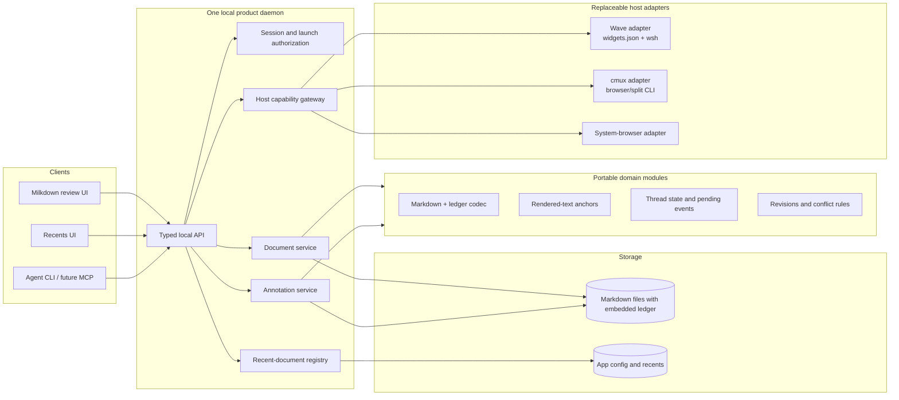

# Tether

## Product boundary

Tether is a local Markdown review environment for human–agent dialogue. Wave Terminal is its first host, not part of its domain model.

The product should own:

* Milkdown/Crepe editing and rendering;
* the embedded annotation ledger and anchor resolution;
* body and annotation conflict handling;
* document sessions and safe filesystem writes;
* a host-neutral recent-document registry and Recents page;
* the local HTTP API and process lifecycle;
* agent-facing CLI commands, followed later by MCP and harness skills.

A host adapter should own only:

* detecting and describing the host's capabilities;
* placing a browser view in that host;
* installing or updating host launchers and widgets;
* routing “open linked document,” “reveal,” and “open externally” actions;
* passing host destination context to the product.

This keeps the durable document format and agent workflow usable without Wave or cmux.

## Proposed architecture



One daemon should serve every open document. Each widget or browser pane is a separate page and client session, not a separate Bun server. The per-file mutation queue already supports the important concurrency shape: several views, including several views of the same file, can share one writer and one process.

## Interface boundaries

### Host adapter

```ts
type HostCapabilities = {
  embeddedBrowser: boolean;
  hiddenNavigation: boolean;
  widgetInstallation: boolean;
  fileNavigatorHook: boolean;
  revealFile: boolean;
};

interface HostAdapter {
  id: "wave" | "cmux" | "calyx" | "obsidian" | "browser";
  detect(): Promise<boolean>;
  capabilities(): HostCapabilities;
  openView(url: string, target?: HostTarget): Promise<void>;
  openExternal(pathOrUrl: string): Promise<void>;
  revealFile?(path: string): Promise<void>;
  installLaunchers?(): Promise<InstallResult>;
}
```

The web client should never call `wsh` or `cmux`. It calls generic daemon actions; the daemon selects the active adapter. Unsupported actions are reported through the capability manifest rather than simulated.

The capability manifest is a small response from the daemon describing what the active host can actually do. The requesting web UI or CLI uses it to show, hide, or disable actions and receives a clear `unsupported` result if it requests an unavailable one. “Rather than simulated” means that an adapter should not silently substitute a different behavior—for example, opening the system browser when the caller requested an embedded split—and present that substitution as equivalent.

### Browser bootstrap

The Milkdown client should depend only on standard browser APIs and the product's HTTP contract. It should receive its daemon origin, scoped session, document grant, and host capabilities during launch. Generic client actions such as `openDocument`, `revealFile`, and `openExternal` go through the daemon; the active adapter decides whether they become a Wave block, cmux split, system-browser window, Obsidian pane, or an unsupported-capability response.

Do not import host SDKs into the shared web application. Host-specific browser code, if a host eventually requires it, belongs in a narrow bridge injected by that adapter.

### Document gateway

The current server treats membership in Wave Recents as file authorization: before it reads or writes a requested path, it checks whether that file appears in the Recents list. Recents therefore acts as the allowlist of files the server may touch. This prevents a browser session or malformed request from naming an arbitrary local file, but it mixes a convenience feature with an access-control responsibility.

Tether still needs an access boundary even though it runs locally. Its browser UI sends filesystem operations to a process that has the user's permissions; without limits, a stolen session, UI defect, or compromised browser dependency could ask that process to read or overwrite any file the user can access. An explicit CLI or host launch should instead grant that browser session access to a particular document. Recents then remains only a convenience index.

```ts
interface DocumentGateway {
  open(path: string): Promise<DocumentSession>;
  read(session: DocumentSession): Promise<DocumentSnapshot>;
  saveBody(input: SaveBodyInput): Promise<DocumentSnapshot>;
  appendEvent(input: AppendEventInput): Promise<DocumentSnapshot>;
}
```

All body and ledger mutations continue through one service and one per-real-path queue.

### Recents

Recents belongs to the product because every host needs the same file history. The Wave adapter should install a Wave launcher for the product's Recents page; it should not maintain a separate Wave-specific history implementation. A cmux adapter can open that same page in a browser split. The registry can remain a small JSON file initially and later move to SQLite only if queries or concurrency justify it.

### Agent tooling

Keep the current command semantics but give them a product CLI:

```text
mdreview pending <file> --actor codex
mdreview thread <file> <thread-id>
mdreview reply <file> <thread-id> --actor codex --body-file -
mdreview resolve <file> <thread-id> --actor codex
mdreview acknowledge <file> --actor codex --through <seq> --body-revision <rev>
```

The CLI should use the daemon API so browser clients and agents share the same mutation serialization. An MCP server can wrap the same typed client later; it should not reimplement ledger writes. Harness skills should describe the review protocol and invoke either CLI or MCP.

The public CLI contract should be stable across harnesses and implementation languages:

* stdout contains one versioned JSON response object for ordinary commands;
* diagnostics and human-readable progress go only to stderr;
* failures use documented exit codes and structured JSON errors;
* substantial input can be supplied through stdin or `--body-file`;
* newline-delimited JSON is opt-in only for genuinely streaming commands such as `watch`.

```json
{
  "protocol": 1,
  "ok": true,
  "command": "review.pending",
  "data": {}
}
```

## Process and security model

* Run one loopback daemon per OS user, independent of Wave's Recents server.
* Let the OS allocate an available port instead of reserving a product-specific range. Store discovery data in the per-user app runtime directory, guarded by a single-instance lock. Do not put ephemeral daemon state in a project file.
* Use a short-lived launch ticket exchanged for an HttpOnly, SameSite session cookie. Avoid keeping the daemon bearer token in widget URLs or browser history.
* Scope each browser session to explicitly opened files. Do not make every recent file writable merely because it appears in the registry.
* Serve each browser launch beneath a session-specific path and scope its cookie to that path. This prevents simultaneous widgets from overwriting one another's grants while allowing app-wide preferences to remain shared separately.
* Keep atomic replace, separate body/ledger revisions, and per-real-path serialization:
  * **Atomic replace:** write a complete temporary file, then swap it into place in one filesystem operation. A crash during saving should leave either the old complete file or the new complete file, not a half-written file.
  * **Separate revisions:** track changes to the Markdown body and annotation ledger independently. Adding a comment should not look like the underlying proposal changed, and each kind of save can detect the conflict relevant to it.
  * **Per-real-path serialization:** resolve aliases and symbolic links to the actual file, then perform writes to that file one at a time. Two open views cannot overwrite each other's nearly simultaneous changes.
* Preserve the embedded ledger as the portable source of truth. App state contains preferences and discovery metadata, not required review history.

The discovery record should contain only enough information for a CLI or adapter to validate and contact the daemon:

```json
{
  "protocol": 1,
  "instanceId": "uuid",
  "pid": 12345,
  "origin": "http://127.0.0.1:51842",
  "startedAt": "2026-08-28T22:30:00Z"
}
```

On every connection, validate the PID, service identity, and protocol version. Recover stale records under the instance lock. Do not store a durable browser bearer token in the discovery file. The CLI discovers the daemon; the browser receives a short-lived launch URL and does not perform discovery itself.

## Repository shape

Start as one Bun package with enforced module boundaries. Do not begin with a publication-oriented monorepo.

```text
tether/
  src/
    core/                 # ledger, anchors, derived state, revisions
    documents/            # filesystem gateway, mutation queue, sessions
    server/               # HTTP API, lifecycle, authentication
    web/                  # Milkdown application and UI
    recents/              # neutral registry and Recents page
    cli/                  # launch and agent review commands
    hosts/
      host-adapter.ts
      browser.ts
      wave.ts
      cmux.ts             # added after Wave parity
      calyx.ts            # added after a capability audit
      obsidian.ts         # plugin lifecycle and vault translation
  integrations/
    wave/                 # widget templates and installer resources
    agents/               # skill/MCP packaging when ready
  tests/
  docs/
```

Split packages only when a real consumer needs independent versioning—for example, publishing the ledger codec or MCP server separately.

## Transition from the current viewer

Keep the current Roger implementation available as the daily-use fallback while Tether develops. Freeze it at a committed working state and limit further changes to serious defects.

Install Tether beside it under a separate preview profile. The preview must use its own daemon identity, runtime discovery and lock files, configuration, Recents registry, browser sessions, preferences, logs, and Wave widget IDs. It must not replace or rewrite the current Markdown or recent-file widgets before cutover.

During early testing, use copied documents by default. Do not edit the same file concurrently through the legacy and Tether daemons: their per-file mutation queues cannot serialize writes across processes. A real document may be tested sequentially after closing its legacy view.

Delay the annotation-sentinel rename until after Tether becomes the primary viewer and its rollback window closes. Tether may temporarily retain `wave-annotations:v1` during extraction and parity testing. This is transitional compatibility, not a commitment to preserve the legacy format indefinitely; it separates retiring the application from migrating durable files.

Tether is ready to become primary when the following manual checks pass:

* open, edit, save, close, and reopen;
* create, reply to, resolve, filter, and preserve threads;
* preserve annotation bytes through body edits;
* open multiple different documents and multiple views of one document;
* open wikilinks without replacing the source view;
* maintain Recents correctly;
* shut down without stranded processes;
* recover clearly from stale host views and save conflicts.

Cut over reversibly: back up Wave configuration and retained annotated documents, import legacy Recents, point the familiar widgets at Tether, and hide rather than delete a legacy launcher. Keep the old document format through a short rollback window. After acceptance, migrate the retained documents once and remove the legacy launcher.

## Extraction plan

### Phase 1 — establish the standalone core

Create the public `tether` repository under the MIT license and import the current implementation at its committed working state. Move the ledger, anchor projection, thread derivation, Markdown codec, and their tests first. Keep domain names host-neutral while temporarily retaining the existing annotation sentinel for transition compatibility.

The existing annotated documents were prototypes and do not require permanent backward compatibility. Delay the sentinel rename and one-time conversion until Tether has passed the cutover gate and rollback window.

Exit condition: core tests pass in the new repository and read and write the transitional format without changing existing document or ledger bytes unnecessarily.

### Phase 2 — separate the daemon from Wave

Build this phase entirely in the Tether repository. Use the committed Roger implementation as extraction source, not as a second runtime dependency. Carry forward the current Milkdown UI and document/review behavior, but place the filesystem service, daemon lifecycle, browser session, Recents registry, CLI, and system-browser launch behind host-neutral boundaries.

The phase has one vertical-slice target: `mdreview open file.md` starts or safely reuses one Tether daemon, grants one browser session access to that canonical Markdown file, records it in Tether Recents, and opens the fully functional editor in the default browser. The working Wave viewer remains installed and unchanged.

#### Runtime and discovery contract

* Bind only to `127.0.0.1` and ask the OS for an available port (`port: 0`); do not scan a fixed range.
* Run at most one daemon per OS user and Tether profile. Support `TETHER_PROFILE`, `TETHER_RUNTIME_DIR`, and `TETHER_CONFIG_DIR` overrides so tests and the preview installation are isolated from the eventual default profile. Reject unsafe profile names.
* Keep discovery and the single-instance lock in the private runtime directory, with directory permissions restricted to the current user. Keep Recents in the profile's config directory. Neither belongs in a project checkout.
* The discovery record contains only `protocol`, `instanceId`, `pid`, `origin`, and `startedAt`. `/health` returns the same service identity and protocol without credentials.
* Serialize startup under an exclusive lock. Validate a discovered process by PID plus `/health` identity, instance ID, and protocol. Recover stale records and locks. Simultaneous launchers must converge on the same daemon.
* Keep CLI control credentials out of the discovery record and out of browser URLs. If the loopback control API needs a persistent secret, store it separately with user-only permissions and never expose it to browser code. Do not log credentials.

#### Browser launch and authorization contract

* An explicit CLI open is the authority to access one resolved, existing `.md` or `.markdown` file. Resolve the real path before granting it. Recents records the successful open but confers no read or write permission.
* Mint a cryptographically random, single-use launch ticket with a short expiry. The initial launch URL may contain that ticket once; exchanging it creates a session-specific route and an `HttpOnly`, `SameSite=Strict` cookie scoped to that route, then redirects immediately to a ticket-free URL.
* A browser session grants one canonical document. Browser document endpoints derive the path from the session and must not accept an arbitrary filesystem path from the client.
* Each open view receives a distinct session, including two views of the same file. All sessions still share the daemon's per-real-path mutation queue.
* A wikilink resolves relative to the current document, validates the target, records it in Recents, mints a new document session, and asks the active host adapter to open it. The source view must remain on its original document.
* Serve no permissive CORS policy. Validate same-origin browser mutations in addition to the scoped cookie. Return explicit JSON errors for expired, reused, invalid, or unauthorized tickets and sessions.

#### Document and review service contract

* Extract the current read, exact export, body save, annotation append, pending/thread lookup, reply, resolve, reopen, edit, delete, and acknowledge behavior. Preserve the transitional `wave-annotations:v1` envelope unchanged.
* Retain atomic replacement, source-file permissions, separate body and ledger revisions, malformed-ledger read-only recovery, and complete read–validate–write transactions serialized by canonical real path.
* Keep thread semantics already established in the product: comments and replies form threads; state is only open or resolved; orphaned is an independent location condition; orphaned threads remain replyable. Agent workflow policy remains outside the domain model.
* Keep leases, explicit release, expiry, startup grace, and idle shutdown. The daemon process must actually exit after shutdown; the prior high-CPU stranded-process failure gets a process-level regression test.

#### Recents and host contract

* Implement a small product-owned JSON registry using canonical paths, most-recent-first ordering, deduplication, stale-entry tolerance, and atomic writes. Do not use SQLite in this phase.
* Define the narrow `HostAdapter` and capability response now. Implement only the system-browser adapter. It may use the platform's ordinary URL opener through an injectable command runner; unsupported actions remain explicit.
* The shared web application imports no Wave or cmux code and reads its document/session bootstrap from the daemon rather than Wave query parameters.

#### CLI and response contract

* Provide the source-checkout executable `mdreview`. Implement `open` plus minimal `daemon status` and `daemon stop` operations needed to diagnose lifecycle behavior. Defer the polished review-command suite, MCP, and harness skill packaging to Phase 5 unless reuse of the existing review commands is nearly free.
* Ordinary stdout is exactly one versioned JSON object; diagnostics go to stderr. Errors are structured and use documented nonzero exit codes. Browser opening is injectable or suppressible for automated tests.

#### Verification and non-goals

Automated coverage should include document grants, ticket expiry and single use, cookie/path scoping, denial of arbitrary paths, Recents not granting access, conflict handling, concurrent same-file mutation, discovery reuse, simultaneous startup, stale discovery recovery, clean idle/explicit shutdown, and the CLI JSON contract. Use unit, HTTP integration, and process-level tests; browser automation and Playwright are not required.

Do not install or alter Wave widgets, read Wave configuration, introduce cmux behavior, rename the annotation sentinel, add SQLite, build MCP, or edit the same real document concurrently in Tether and the legacy Wave daemon during this phase.

Exit condition: from a source checkout, `mdreview open file.md` starts or reuses one daemon and opens the extracted editor in the default browser without Wave installed; the automated suite passes; two views and concurrent writes behave correctly; Recents is independent of authorization; stale discovery and shutdown leave no stranded Bun process; and the current Wave viewer still works unchanged.

### Phase 3 — restore Wave parity through an adapter

Begin with a Wave capability record tied to the installed client version. For Wave 0.14.5, record `fileNavigatorHook: false`: Wave exposes no public file-extension association or native file-navigator routing hook. Tether's widgets, Recents page, CLI, and wikilinks can open documents, but native navigator parity requires a future upstream Wave capability or a modified Wave build.

Move `widgets.json` edits, web-block creation, hidden-navigation metadata, destination routing, and linked-document opening into `hosts/wave.ts` plus an installer. Replace Wave's current Markdown and Recents scripts with thin calls to the standalone CLI.

Install the dynamic launcher as a command widget with explicit `controller: "cmd"`, `cmd`, `cmd:args`, `cmd:shell: false`, `cmd:jwt: true`, and `cmd:closeonexit: true`. A direct web widget cannot mint a dynamic daemon port and short-lived launch ticket. Use Wave's hidden `wsh createblock` only behind an exact-version check because the public `wsh web open` cannot attach required metadata before first navigation. Provide a clear degraded fallback if that hidden command disappears.

The Wave adapter should set `web:hidenav` when supported and treat `web:partition` as optional additional isolation rather than the core session model. Normalize `wsh`'s inconsistent stdout and stderr behind Tether's own JSON contract. Continue routing linked-document actions through the host gateway because `window.open` does not preserve Tether or Wave block metadata.

Keep Wave authority narrow. The launcher may use the injected `WAVETERM_JWT` to perform its immediate `wsh` operation, but the generic daemon must not inherit, persist, log, or expose it. Do not place Wave credentials or Tether launch tickets in `widgets.json`, `cmd:env`, block metadata, discovery files, or durable URLs.

Wave exposes no documented web-content event for block closure. Retain explicit page release, expiring leases, idle shutdown, and stale-process recovery. If Wave restores a block containing an obsolete dynamic URL, show a relaunch state instead of a blank or indefinitely failed view.

Wave's documented custom-widget model supports terminal launchers and direct web widgets; the existing terminal-to-web handoff remains reasonable because the daemon URL and launch ticket are created dynamically. Wave now also documents `wsh launch` for named custom widgets, which should be evaluated during implementation. [Wave custom widgets](https://docs.waveterm.dev/customwidgets), [Wave release notes](https://docs.waveterm.dev/releasenotes)

Exit condition: the Markdown widget, three recent-file widgets, Recents page, wikilinks, hidden navigation, simultaneous session isolation, credential isolation, and stale-block recovery behave as specified, while Roger contains only configuration or thin wrappers. Native Wave file-navigator routing is explicitly out of scope until Wave exposes a supported hook.

### Phase 4 — add the cmux adapter

Begin with a versioned documentation and capability audit of cmux. Record the supported commands and constraints for browser/split creation, workspace and surface targeting, URL opening, process lifecycle, close detection, environment context, installation, and any extension or plugin boundary. Convert the findings into a small capability matrix before fixing the adapter contract; distinguish documented behavior from behavior verified experimentally.

Implement browser-pane placement with cmux's CLI and workspace/surface context. Do not promise widget-bar or file-navigator parity where cmux exposes no equivalent capability; expose those differences honestly through adapter capabilities. cmux currently provides an embedded browser plus CLI/socket automation, so opening the same product URL in a split is the natural first integration. [cmux](https://cmux.com/), [cmux browser automation](https://cmux.com/docs/browser-automation)

Exit condition: the versioned capability matrix is recorded; `mdreview open file.md` invoked inside cmux opens beside the calling terminal; and wikilinks open additional product views without replacing their source view.

### Phase 5 — package agent integrations

Stabilize the CLI response schema, then add a focused review-workflow skill. Add MCP only when tool discovery or structured mutation materially improves actual harness use. Both integrations use the same daemon client and event protocol.

Exit condition: Codex and Claude Code can inspect pending threads, answer or resolve them, and acknowledge only the sequence they received without reading the full document by default.

### Phase 6 — extend host coverage

Add Calyx only after auditing its actual browser-placement, process, and command interfaces. Add Obsidian as a distinct plugin adapter: it may need to own plugin lifecycle, vault-relative path translation, workspace panes, wikilink translation, and loopback-content restrictions. Reuse the same web client and daemon protocol; do not move vault or terminal concepts into the domain model.

Exit condition: each adapter passes the same open/read/review/save contract tests and reports unsupported host capabilities explicitly. A system-browser fallback remains available when a host cannot embed the application.

## What should remain deferred

* accounts, cloud sync, or remote collaboration;
* SQLite merely for architectural neatness;
* a plugin SDK beyond the one host interface actually needed;
* generalized editor extension APIs;
* package splitting before independent consumers exist;
* a general migration system for ephemeral prototype documents;
* cmux emulation of Wave-only concepts;
* Calyx or Obsidian integration before their host capabilities and security constraints are audited.

## Main risks

1. **Format transition.** The prototype uses the host-specific `wave-annotations:v1` sentinel. Retain it through extraction and rollback, then convert this plan and the small retained document set once. Do not let temporary compatibility become an indefinite second format.
2. **Installer ownership.** Editing `widgets.json` is a material host mutation. The Wave adapter needs idempotent install, status, upgrade, and uninstall operations with backups or atomic writes.
3. **File authorization.** A local web server that accepts arbitrary paths is unsafe. Explicit launch grants and session scoping need to land with the standalone server, not afterward.
4. **Lifecycle races.** Multiple simultaneous launchers must converge on one daemon. The discovery file needs PID validation, protocol negotiation, and stale-entry recovery.
5. **Host feature asymmetry.** Wave and cmux do not expose identical concepts. The contract must model capabilities instead of forcing false parity.

## Extraction decisions

* Product and repository name: **Tether** / `tether`.
* Repository and license: **public, MIT**.
* MVP distribution: **source checkout**.
* Prototype annotation compatibility: **transitional only**. Keep the existing sentinel through cutover and rollback, then convert this plan once because it governs later phases.
