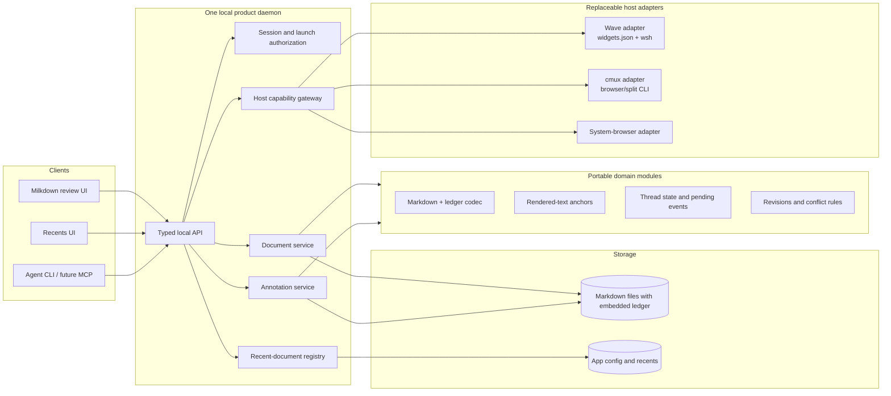

# Tether product and release plan

## Release direction

Tether is a local Markdown editor and review environment for human–agent dialogue. The first public release serves people building software with coding agents who want easy setup, useful defaults, and room to customize. Formal engineering experience is not a prerequisite.

Release on macOS only. Welcome contributor-led Linux and Windows ports, with build and test evidence required before advertising support. Publish the tested macOS versions and CPU architectures; do not infer support from a successful cross-compilation. Wave, cmux, and the system browser are optional viewing environments over one installation and shared private data.

This release plan supersedes the historical extraction plan below. In particular, embedded review ledgers, a JSON-only registry, source-checkout-only distribution, and the old phase ordering are no longer current requirements.

## Current implementation checkpoint

Reviewed 2026-09-07 against the working tree, README, CLI, lifecycle/config code, and [private Folio implementation](private-folio-implementation.md). The tree contains ongoing implementation work; presence in code is not release validation.

- Markdown bodies and private reviews are separate. SQLite holds conversations, Folio metadata, review receipts, and recovery state. Existing embedded footers remain ordinary document content, without automatic import.
- Folio supports active/archive views, intake, filtering, pinning, Locate, retention, and `.tether` transfers. A transfer includes current open threads; it is not a complete backup of private state.
- The source checkout provides `mdreview`, `tether`, and `Open Tether.command`. A macOS release builder now bundles the runtime, web assets, CLI, daemon, and host bridges; a checksum-verifying installer manages versioned releases. An unsigned Apple Silicon candidate has passed isolated local smoke checks. Signing is optional; public publication requires approval.
- Normal launches already share the established `preview` profile; `default` aliases it. Preserve existing data when packaging. Users should not need profile environment variables.
- Wave and cmux adapters exist with version/build restrictions. The browser adapter exists, but a fresh-user browser walkthrough remains unverified in this review.
- Persistent view state and controlled restart recovery exist. Packaged startup, reboot, stale tabs, occupied ports, and stopped-service recovery still need end-to-end release validation.
- Compact agent reads, revision-safe body saves, and retry-safe review mutations exist. Preserve these contracts while packaging agent integrations.

## Installation and everyday startup

One installer serves both a copyable terminal command and an agent-assisted setup prompt. Both paths use the same versioned release and deterministic setup operations. A normal installation should require no Git checkout, separate runtime installation, build tools, or administrator access.

1. Detect macOS and CPU architecture, obtain a supported release, verify its integrity, and install within the user's account. Report the installed version and location. Handle PATH setup explicitly and make the first launch work in the current shell.
2. Detect available host integrations. Recommend the invoking supported terminal; allow multiple integrations and browser-only use. Preview host configuration changes and preserve unrelated configuration. Rerunning setup must not duplicate widgets or installations.
3. Offer installation of the user's selected agent integration, with the exact files and scope shown before changes. Keep this optional and repeatable. Never silently overwrite existing agent instructions.
4. Start or reuse the local service, preload Folio's welcome document, and open that document for the first review exchange. Installation is successful only when the reader can connect.

Implemented public commands (use `bun ./tether` from a source checkout):

```sh
tether
tether open proposal.md
tether open proposal.md --host browser
tether setup
tether doctor
tether update
tether backup --output /path/to/new-backup
tether restore --source /path/to/backup --directory /path/to/new-config
tether uninstall --confirm
```

`tether` opens Folio. Every launch starts or reconnects to the service without asking users to manage ports or daemon processes. Keep `mdreview` compatible for existing automation; public naming must not break the agent JSON contract. Setup must offer explicit options for noninteractive agent use and avoid hanging on prompts when no terminal is available.

Select the destination per launch: explicit host override, then a saved preference, then the current supported terminal, then browser. The default preference is “follow my terminal.” Installing both Wave and cmux does not choose a permanent host or create separate histories. Bind callbacks to each view's launch target; do not let the last host used take over other views.

If a requested or detected integration is incompatible or unavailable, explain why and offer an explicit browser launch. Do not silently substitute a browser after a host launch fails. Report Wave/cmux compatibility and direct/callback readiness in setup and diagnostics.

Provide a clickable macOS launcher that works outside the source checkout and uses the same startup path. Outside a terminal, use browser unless a saved host destination can be resolved reliably. Include matching startup instructions in README and Folio's stopped screen. A disconnected browser page cannot itself restart a dead local service without a separate launch mechanism; provide a working launcher/command and honest recovery guidance.

The runtime and web assets are packaged together, with installed entry points for the daemon and both host bridges. Start on demand; launch-at-login is optional future convenience. Managed installations passively check for stable releases through Folio, at most once every six hours. A bottom notice offers Install, Release Notes, and Dismiss; dismissal persists per version across views and restarts. Install drains active requests, stops the service, creates a private-state backup, installs the offered version, and starts the selected runtime. The terminal update command still requires a stopped service. Uninstall removes owned command/widget launchers and retains private data, agent skills, and versioned release files. The published download/update path cannot be validated until release assets exist.

## First-use document

Preload a local, editable **Getting started with Tether** document in Folio. Seed it once per user store, outside the installation directory, so updates cannot overwrite the user's edits or practice conversation. Users can archive it and reopen it through Help; reopening must not silently reset it.

Keep the document short, with one action per instruction:

1. Open a Markdown file from Folio.
2. Highlight the example sentence and leave a comment.
3. Ask the connected coding agent to review the document's comments, using a copyable prompt that identifies this file.
4. Read its reply in Tether, then resolve the thread when finished.
5. Edit the document and return to Folio to reopen it later.

Include a brief explanation that Markdown stays in the user's files, reviews are stored privately, and `.tether` export is the deliberate way to share open conversations. State that leaving a comment does not automatically invoke an agent. Offer an agent-setup link when that step was skipped. Put reference material in linked help instead of expanding the welcome document into a manual.

Exit condition: a new user can install, leave a comment, receive an agent reply, resolve it, and reopen the document without maintainer guidance.

## Work required before release

Scope correction (2026-09-09): the Todoist sequence now puts core review, installation/recovery validation, and publication before optional host coverage and polish. Developer ID signing/notarization, logo/banner redesign, recruited user research, and a private vulnerability-reporting route are optional investments, not universal release blockers. No App Store release is planned. These decisions supersede mandatory wording about those items elsewhere in this plan and its historical checkpoints.

Validate the actual downloaded artifact before promising easy installation. Resolve any observed installation failure or narrow the release scope. Test each browser and host before advertising its support; additional environments may be deferred. Core usability, private-data durability, accurate documentation, and publication approval remain required. Agents may complete verifiable tasks with recorded evidence; automated tests do not establish fresh-account, live-host, sleep/reboot, or subjective acceptance.

The original six subtasks were reviewed on 2026-09-07 and are tracked in the Todoist `tether` project. The twelve tasks added then now distinguish required validation from optional investments. The table records acceptance for the selected scope, not an assertion that every human validation has passed.

| Work | Required result |
| --- | --- |
| Fix cmux Cmd+F, if advertising cmux support | Find works predictably in the reader; verify focus, Escape, repeated searches, and interaction with host shortcuts. |
| Create the Tether theme | Finish coherent built-in light/dark themes across Folio, reader, comments, dialogs, code blocks, and all interaction states. |
| Create onboarding Markdown | Ship the seeded welcome document and verify the full human–agent exchange. |
| Clean up GitHub documentation | Lead README with purpose, screenshots, install, and everyday startup. Make repository agent guidance portable and remove maintainer-specific paths and environment assumptions. |
| Create the install kit/flow | Deliver the shared installer, optional integrations, diagnostics, and packaged launch path described above. |
| Startup instructions in README and stopped Folio | Make quitting, reopening, and recovery understandable and executable from every advertised host. |

Optional visual polish includes refining the logo/banner drafts and redesigning Folio and reader toolbar icons. Existing suitable assets can serve the first release. Legibility, contrast, accessible names, keyboard focus, and usable interaction states remain acceptance criteria. Hart reviews new visual direction before adopting it; screenshots should show the interface actually shipped.

Use shared theme tokens during the built-in theme pass where useful. User-authored, shareable themes are a later feature; a theme format, import/export, gallery, and extension API are not release requirements.

Package one shared agent review protocol with only the installation and host details each supported agent needs. Keep progressive reads: pending, one thread, bounded context/outline/diff, and full body only when needed. Teach exact cursor acknowledgement, operation retries, and leaving answers open for human attention. Verify setup in a fresh agent session and recovery after lost conversation context. MCP remains optional until it solves a demonstrated integration problem.

## Release gates and additional recommendations

- **Fresh installation:** test a new macOS account without the checkout, Bun, or maintainer shell configuration. Exercise terminal and agent-assisted installs, the clickable launcher, paths with spaces, and rerunning setup. Publish only the OS/architecture combinations actually validated.
- **Distribution:** produce immutable GitHub release assets, integrity checks, and a tested update path. Test the actual downloaded artifact with Gatekeeper enabled. Developer ID signing and notarization are optional; decide from the intended installation experience and observed results. Apple's [distribution guidance](https://developer.apple.com/developer-id/) describes this path for distribution outside the App Store.
- **Host coverage:** validate the browser(s) selected for release. Wave, cmux, and additional browser coverage may be deferred; validate each before advertising support. When multiple hosts are supported, test simultaneous use with two views of the same file. Record limitations rather than implying equal host features. Version restrictions must produce actionable setup guidance.
- **Return and recovery:** test quit/reopen, service restart, laptop sleep, reboot, stale tabs, unavailable host bridges, and port conflicts. Preserve scoped access and recoverable drafts. Distinguish automatic reconnection from cases requiring a fresh launch.
- **Private-data durability:** provide a tested backup/restore procedure for the full private store and preferences, separate from partial conversation export. Verify update compatibility, interrupted updates, missing/moved files, external edits, save conflicts, and import collisions. Do not assume an older executable can open an upgraded database safely.
- **Archive policy — implemented:** retain archived conversations indefinitely by default; expiry is opt-in. Old implicit 30-day deadlines are cancelled before expiry sweeps, while explicit retention choices remain intact. Hart's running profile was also set to Keep forever without deleting any conversations.
- **Usability:** verify keyboard-only commenting, replying, finding, and resolving; focus order; readable contrast in both themes; and accessible toolbar labels. Recruiting target users for an uncoached onboarding study is optional and may follow the initial candidate.
- **GitHub readiness:** provide a concise contribution path, reproducible macOS build/check instructions, known limitations, and issue-report guidance. A private vulnerability-reporting route is optional; do not promise one until it exists. Invite Linux/Windows contributions with concrete test expectations. Audit shipped examples, screenshots, and guidance for maintainer-specific data and absolute paths; verify licenses for fonts, icons, and visual assets.

Run the complete repository check on the release candidate, then inspect the final diff. Automated checks supplement fresh-install and human walkthroughs; a green suite does not establish packaging or host usability.

Recommended order: review the implemented core workflow; validate installation, onboarding, and recovery; document tested support and approve publication. Optional host coverage, branding, recruited research, and signing can follow unless selected for the initial release. Required validation follows the capabilities actually advertised.

### Execution checkpoint — 2026-09-07

The welcome document, repeatable setup, optional skill/Wave installation, saved/per-launch host choice, Folio help entry, stopped-screen instructions, backup/restore, update/uninstall tooling, portable contributor guidance, and macOS CI definition are implemented. README now leads with the new-user source flow and distinguishes the unpublished release installer. The formatting overflow menu supports keyboard activation and Insert code block. Browser comments now use the neutral author `human` instead of a hardcoded maintainer name; existing authors are unchanged. The existing cmux find adapter has automated coverage; its real-host acceptance remains a manual gate.

See [Release and recovery](release.md) for candidate build, installation, verification, and recovery procedures. `scripts/check-release.ts` verifies a packaged app with a minimal PATH and isolated profile; `scripts/check-install.ts` exercises local archive installation and recoverable uninstall. CI has been prepared but has not run on GitHub. No release has been signed, committed, pushed, or published by this work. Final visuals, live host/browser interaction, fresh-account and sleep/reboot testing, support-matrix approval, private vulnerability reporting, and publication remain human-owned Todoist tasks.

## Later work

- User-created and shared themes, with a documented format and compatibility rules.
- Contributor-led Linux/Windows builds and validation; no support promise until tested.
- Additional host adapters after capability audits, and MCP if needed.
- Optional launch-at-login and richer customization after the basic return path is reliable.
- Accounts, cloud sync, remote collaboration, generalized editor extensions, and a theme marketplace remain outside the initial release.

## Historical architecture and extraction record

The retained record below explains earlier implementation decisions. Its phase instructions, completion statements, data formats, and future-work lists are historical, not the current backlog. Current behavior is described above and in README; the private SQLite implementation supersedes the embedded-ledger design.

<details>
<summary>Original extraction plan and checkpoints</summary>

## Product boundary

Tether is a local Markdown review environment for human–agent dialogue. Wave Terminal is its first host, not part of its domain model.

The product should own:

* Milkdown/Crepe editing and rendering;
* the embedded annotation ledger and anchor resolution;
* body and annotation conflict handling;
* document sessions and safe filesystem writes;
* a host-neutral recent-document registry and Recents page;
* the local HTTP API and process lifecycle;
* agent-facing CLI commands, followed later by MCP and harness skills.

A host adapter should own only:

* detecting and describing the host's capabilities;
* placing a browser view in that host;
* installing or updating host launchers and widgets;
* routing “open linked document,” “reveal,” and “open externally” actions;
* passing host destination context to the product.

This keeps the durable document format and agent workflow usable without Wave or cmux.

## Proposed architecture



One daemon should serve every open document. Each widget or browser pane is a separate page and client session, not a separate Bun server. The per-file mutation queue already supports the important concurrency shape: several views, including several views of the same file, can share one writer and one process.

## Interface boundaries

### Host adapter

```ts
type HostCapabilities = {
  embeddedBrowser: boolean;
  hiddenNavigation: boolean;
  widgetInstallation: boolean;
  fileNavigatorHook: boolean;
  revealFile: boolean;
};

interface HostAdapter {
  id: "wave" | "cmux" | "calyx" | "obsidian" | "browser";
  detect(): Promise<boolean>;
  capabilities(): HostCapabilities;
  openView(url: string, target?: HostTarget): Promise<void>;
  openExternal(pathOrUrl: string): Promise<void>;
  revealFile?(path: string): Promise<void>;
  installLaunchers?(): Promise<InstallResult>;
}
```

The web client should never call `wsh` or `cmux`. It calls generic daemon actions; the daemon selects the active adapter. Unsupported actions are reported through the capability manifest rather than simulated.

The capability manifest is a small response from the daemon describing what the active host can actually do. The requesting web UI or CLI uses it to show, hide, or disable actions and receives a clear `unsupported` result if it requests an unavailable one. “Rather than simulated” means that an adapter should not silently substitute a different behavior—for example, opening the system browser when the caller requested an embedded split—and present that substitution as equivalent.

### Browser bootstrap

The Milkdown client should depend only on standard browser APIs and the product's HTTP contract. It should receive its daemon origin, scoped session, document grant, and host capabilities during launch. Generic client actions such as `openDocument`, `revealFile`, and `openExternal` go through the daemon; the active adapter decides whether they become a Wave block, cmux split, system-browser window, Obsidian pane, or an unsupported-capability response.

Do not import host SDKs into the shared web application. Host-specific browser code, if a host eventually requires it, belongs in a narrow bridge injected by that adapter.

### Document gateway

The current server treats membership in Wave Recents as file authorization: before it reads or writes a requested path, it checks whether that file appears in the Recents list. Recents therefore acts as the allowlist of files the server may touch. This prevents a browser session or malformed request from naming an arbitrary local file, but it mixes a convenience feature with an access-control responsibility.

Tether still needs an access boundary even though it runs locally. Its browser UI sends filesystem operations to a process that has the user's permissions; without limits, a stolen session, UI defect, or compromised browser dependency could ask that process to read or overwrite any file the user can access. An explicit CLI or host launch should instead grant that browser session access to a particular document. Recents then remains only a convenience index.

```ts
interface DocumentGateway {
  open(path: string): Promise<DocumentSession>;
  read(session: DocumentSession): Promise<DocumentSnapshot>;
  saveBody(input: SaveBodyInput): Promise<DocumentSnapshot>;
  appendEvent(input: AppendEventInput): Promise<DocumentSnapshot>;
}
```

All body and ledger mutations continue through one service and one per-real-path queue.

### Recents

Recents belongs to the product because every host needs the same file history. The Wave adapter should install a Wave launcher for the product's Recents page; it should not maintain a separate Wave-specific history implementation. A cmux adapter can open that same page in a browser split. The registry can remain a small JSON file initially and later move to SQLite only if queries or concurrency justify it.

### Agent tooling

Keep the current command semantics but give them a product CLI:

```text
mdreview pending <file> --actor assistant
mdreview thread <file> <thread-id>
mdreview reply <file> <thread-id> --actor assistant --body-file -
mdreview resolve <file> <thread-id> --actor assistant
mdreview acknowledge <file> --actor assistant --through <seq> --body-revision <rev>
```

The CLI should use the daemon API so browser clients and agents share the same mutation serialization. An MCP server can wrap the same typed client later; it should not reimplement ledger writes. Harness skills should describe the review protocol and invoke either CLI or MCP.

The public CLI contract should be stable across harnesses and implementation languages:

* stdout contains one versioned JSON response object for ordinary commands;
* diagnostics and human-readable progress go only to stderr;
* failures use documented exit codes and structured JSON errors;
* substantial input can be supplied through stdin or `--body-file`;
* newline-delimited JSON is opt-in only for genuinely streaming commands such as `watch`.

```json
{
  "protocol": 1,
  "ok": true,
  "command": "review.pending",
  "data": {}
}
```

## Process and security model

* Run one loopback daemon per OS user, independent of Wave's Recents server.
* Let the OS allocate an available port instead of reserving a product-specific range. Store discovery data in the per-user app runtime directory, guarded by a single-instance lock. Do not put ephemeral daemon state in a project file.
* Use a short-lived launch ticket exchanged for an HttpOnly, SameSite session cookie. Avoid keeping the daemon bearer token in widget URLs or browser history.
* Scope each browser session to explicitly opened files. Do not make every recent file writable merely because it appears in the registry.
* Serve each browser launch beneath a session-specific path and scope its cookie to that path. This prevents simultaneous widgets from overwriting one another's grants while allowing app-wide preferences to remain shared separately.
* Keep atomic replace, separate body/ledger revisions, and per-real-path serialization:
  * **Atomic replace:** write a complete temporary file, then swap it into place in one filesystem operation. A crash during saving should leave either the old complete file or the new complete file, not a half-written file.
    * here's a test input that should help diagnose whether atomic replace is working as expected.
  * **Separate revisions:** track changes to the Markdown body and annotation ledger independently. Adding a comment should not look like the underlying proposal changed, and each kind of save can detect the conflict relevant to it.
  * **Per-real-path serialization:** resolve aliases and symbolic links to the actual file, then perform writes to that file one at a time. Two open views cannot overwrite each other's nearly simultaneous changes.
* Preserve the embedded ledger as the portable source of truth. App state contains preferences and discovery metadata, not required review history.

The discovery record should contain only enough information for a CLI or adapter to validate and contact the daemon:

```json
{
  "protocol": 1,
  "instanceId": "uuid",
  "pid": 12345,
  "origin": "http://127.0.0.1:51842",
  "startedAt": "2026-08-28T22:30:00Z"
}
```

On every connection, validate the PID, service identity, and protocol version. Recover stale records under the instance lock. Do not store a durable browser bearer token in the discovery file. The CLI discovers the daemon; the browser receives a short-lived launch URL and does not perform discovery itself.

## Repository shape

Start as one Bun package with enforced module boundaries. Do not begin with a publication-oriented monorepo.

```text
tether/
  src/
    core/                 # ledger, anchors, derived state, revisions
    documents/            # filesystem gateway, mutation queue, sessions
    server/               # HTTP API, lifecycle, authentication
    web/                  # Milkdown application and UI
    recents/              # neutral registry and Recents page
    cli/                  # launch and agent review commands
    hosts/
      host-adapter.ts
      browser.ts
      wave.ts
      cmux.ts             # added after Wave parity
      calyx.ts            # added after a capability audit
      obsidian.ts         # plugin lifecycle and vault translation
  integrations/
    wave/                 # widget templates and installer resources
    agents/               # skill/MCP packaging when ready
  tests/
  docs/
```

Split packages only when a real consumer needs independent versioning—for example, publishing the ledger codec or MCP server separately.

## Transition from the original viewer — completed 2026-09-01

Tether was developed beside the Roger implementation under an isolated `preview` profile. The manual gate passed, Tether became the sole active viewer and Recents system, and the legacy scripts, processes, and widget definitions were retired. The established profile name remains `preview` temporarily to preserve current Recents, preferences, and session discovery without a second data migration.

The completed gate covered:

* open, edit, save, close, and reopen;
* create, reply to, resolve, filter, and preserve threads;
* preserve annotation bytes through body edits;
* open multiple different documents and multiple views of one document;
* open wikilinks without replacing the source view;
* maintain Recents correctly;
* shut down without stranded processes;
* recover clearly from stale host views and save conflicts.

The Wave installer keeps a pre-cutover widget backup and owns only canonical `tether-*` definitions after removing retired `agent-*` and `tether-preview-*` entries. The original `wave-annotations:v1` sentinel remains the current document envelope until a separate, deliberate format migration; retiring the application does not require rewriting retained documents.

## Extraction plan

### Phase 1 — establish the standalone core

Create the public `tether` repository under the MIT license and import the current implementation at its committed working state. Move the ledger, anchor projection, thread derivation, Markdown codec, and their tests first. Keep domain names host-neutral while temporarily retaining the existing annotation sentinel for transition compatibility.

The existing annotated documents were prototypes and do not require permanent backward compatibility. Delay the sentinel rename and one-time conversion until Tether has passed the cutover gate and rollback window.

Exit condition: core tests pass in the new repository and read and write the transitional format without changing existing document or ledger bytes unnecessarily.

### Phase 2 — separate the daemon from Wave

Build this phase entirely in the Tether repository. Use the committed Roger implementation as extraction source, not as a second runtime dependency. Carry forward the current Milkdown UI and document/review behavior, but place the filesystem service, daemon lifecycle, browser session, Recents registry, CLI, and system-browser launch behind host-neutral boundaries.

The phase has one vertical-slice target: `mdreview open file.md` starts or safely reuses one Tether daemon, grants one browser session access to that canonical Markdown file, records it in Tether Recents, and opens the fully functional editor in the default browser. The working Wave viewer remains installed and unchanged.

#### Runtime and discovery contract

* Bind only to `127.0.0.1` and ask the OS for an available port (`port: 0`); do not scan a fixed range.
* Run at most one daemon per OS user and Tether profile. Support `TETHER_PROFILE`, `TETHER_RUNTIME_DIR`, and `TETHER_CONFIG_DIR` overrides so tests and the preview installation are isolated from the eventual default profile. Reject unsafe profile names.
* Keep discovery and the single-instance lock in the private runtime directory, with directory permissions restricted to the current user. Keep Recents in the profile's config directory. Neither belongs in a project checkout.
* The discovery record contains only `protocol`, `instanceId`, `pid`, `origin`, and `startedAt`. `/health` returns the same service identity and protocol without credentials.
* Serialize startup under an exclusive lock. Validate a discovered process by PID plus `/health` identity, instance ID, and protocol. Recover stale records and locks. Simultaneous launchers must converge on the same daemon.
* Keep CLI control credentials out of the discovery record and out of browser URLs. If the loopback control API needs a persistent secret, store it separately with user-only permissions and never expose it to browser code. Do not log credentials.

#### Browser launch and authorization contract

* An explicit CLI open is the authority to access one resolved, existing `.md` or `.markdown` file. Resolve the real path before granting it. Recents records the successful open but confers no read or write permission.
* Mint a cryptographically random, single-use launch ticket with a short expiry. The initial launch URL may contain that ticket once; exchanging it creates a session-specific route and an `HttpOnly`, `SameSite=Strict` cookie scoped to that route, then redirects immediately to a ticket-free URL.
* A browser session grants one canonical document. Browser document endpoints derive the path from the session and must not accept an arbitrary filesystem path from the client.
* Each open view receives a distinct session, including two views of the same file. All sessions still share the daemon's per-real-path mutation queue.
* A wikilink resolves relative to the current document, validates the target, records it in Recents, mints a new document session, and asks the active host adapter to open it. The source view must remain on its original document.
* Serve no permissive CORS policy. Validate same-origin browser mutations in addition to the scoped cookie. Return explicit JSON errors for expired, reused, invalid, or unauthorized tickets and sessions.

#### Document and review service contract

* Extract the current read, exact export, body save, annotation append, pending/thread lookup, reply, resolve, reopen, edit, delete, and acknowledge behavior. Preserve the transitional `wave-annotations:v1` envelope unchanged.
* Retain atomic replacement, source-file permissions, separate body and ledger revisions, malformed-ledger read-only recovery, and complete read–validate–write transactions serialized by canonical real path.
* Keep thread semantics already established in the product: comments and replies form threads; state is only open or resolved; orphaned is an independent location condition; orphaned threads remain replyable. Agent workflow policy remains outside the domain model.
* Keep leases as advisory presence signals, not authorization lifetime. Document-scoped and Recents sessions survive missed heartbeats, suspended embedded webviews, and laptop sleep. While sessions exist, keep the shared daemon resident and idle until explicit shutdown; it must then actually exit. The prior high-CPU stranded-process failure gets a process-level regression test.

#### Recents and host contract

* Implement a small product-owned JSON registry using canonical paths, most-recent-first ordering, deduplication, stale-entry tolerance, and atomic writes. Do not use SQLite in this phase.
* Define the narrow `HostAdapter` and capability response now. Implement only the system-browser adapter. It may use the platform's ordinary URL opener through an injectable command runner; unsupported actions remain explicit.
* The shared web application imports no Wave or cmux code and reads its document/session bootstrap from the daemon rather than Wave query parameters.

#### CLI and response contract

* Provide the source-checkout executable `mdreview`. Implement `open` plus minimal `daemon status` and `daemon stop` operations needed to diagnose lifecycle behavior. Defer the polished review-command suite, MCP, and harness skill packaging to Phase 5 unless reuse of the existing review commands is nearly free.
* Ordinary stdout is exactly one versioned JSON object; diagnostics go to stderr. Errors are structured and use documented nonzero exit codes. Browser opening is injectable or suppressible for automated tests.

#### Verification and non-goals

Automated coverage should include document grants, ticket expiry and single use, cookie/path scoping, denial of arbitrary paths, Recents not granting access, conflict handling, concurrent same-file mutation, discovery reuse, simultaneous startup, stale discovery recovery, clean idle/explicit shutdown, and the CLI JSON contract. Use unit, HTTP integration, and process-level tests; browser automation and Playwright are not required.

Do not install or alter Wave widgets, read Wave configuration, introduce cmux behavior, rename the annotation sentinel, add SQLite, build MCP, or edit the same real document concurrently in Tether and the legacy Wave daemon during this phase.

Exit condition: from a source checkout, `mdreview open file.md` starts or reuses one daemon and opens the extracted editor in the default browser without Wave installed; the automated suite passes; two views and concurrent writes behave correctly; Recents is independent of authorization; stale discovery and shutdown leave no stranded Bun process; and the current Wave viewer still works unchanged.

### Phase 2.5 — validate the agent review loop

Pull the minimum agent-facing CLI forward before building the Wave adapter. This phase validates Tether's central human–agent workflow against the same daemon, document service, mutation queue, revision checks, and embedded ledger used by the browser. MCP discovery and packaged harness skills remain deferred.

Add these source-checkout commands:

```text
mdreview document read <file>
mdreview document save <file> --expected-body-revision <revision> --body-file <path|->
mdreview pending <file> --actor <actor>
mdreview thread <file> <thread-id>
mdreview reply <file> <thread-id> --actor <actor> --body-file <path|->
mdreview resolve <file> <thread-id> --actor <actor>
mdreview reopen <file> <thread-id> --actor <actor>
mdreview acknowledge <file> --actor <actor> --through <seq> --body-revision <revision>
```

Each command explicitly grants its named canonical Markdown file for one authenticated control operation, runs through `DocumentService`, and closes the temporary grant afterward. It must not require a browser session, use Recents as authority, or expose the daemon control credential. Document save consumes stdin or a body file, requires the body revision returned by read, preserves the embedded ledger, and reports conflicts structurally.

Keep stdout to one protocol-versioned JSON object and stderr for diagnostics only. Distinguish usage, missing document, authorization, invalid ledger, invalid thread, and revision conflict errors with stable codes and nonzero exit status. Pending and thread reads should remain compact so an agent need not ingest the entire document unless it explicitly requests `document read`.

Automated coverage should exercise the real CLI against a reused daemon: read and conflict-safe save; pending, thread, reply, resolve, reopen, and acknowledge; multiline stdin; exact ledger preservation; malformed-ledger refusal; JSON/error contracts; and coexistence with an open browser session on the same file. Playwright, MCP, and skill packaging remain out of scope.

Exit condition: an agent can inspect a copied annotated document, respond to or change the state of its threads, acknowledge only the sequence it received, and safely revise the body without bypassing daemon serialization. The browser reflects those changes through its existing lease refresh, and the full unit, HTTP, CLI, process, type, and bundle checks pass.

### Phase 3 — restore Wave parity through an adapter

Begin with a Wave capability record tied to the installed client version. For Wave 0.14.5, record `fileNavigatorHook: false`: Wave exposes no public file-extension association or native file-navigator routing hook. Tether's widgets, Recents page, CLI, and wikilinks can open documents, but native navigator parity requires a future upstream Wave capability or a modified Wave build.

Move `widgets.json` edits, web-block creation, hidden-navigation metadata, destination routing, and linked-document opening into `hosts/wave.ts` plus an installer. Replace Wave's current Markdown and Recents scripts with thin calls to the standalone CLI.

Install the dynamic launcher as a command widget with explicit `controller: "cmd"`, `cmd`, `cmd:args`, `cmd:shell: false`, `cmd:jwt: true`, and `cmd:closeonexit: true`. A direct web widget cannot mint a dynamic daemon port and short-lived launch ticket. Use Wave's hidden `wsh createblock` only behind an exact-version check because the public `wsh web open` cannot attach required metadata before first navigation. Provide a clear degraded fallback if that hidden command disappears.

The Wave adapter should set `web:hidenav` when supported and treat `web:partition` as optional additional isolation rather than the core session model. Normalize `wsh`'s inconsistent stdout and stderr behind Tether's own JSON contract. Continue routing linked-document actions through the host gateway because `window.open` does not preserve Tether or Wave block metadata.

Keep Wave authority narrow. The launcher may use the injected `WAVETERM_JWT` to perform its immediate `wsh` operation, but the generic daemon must not inherit, persist, log, or expose it. Do not place Wave credentials or Tether launch tickets in `widgets.json`, `cmd:env`, block metadata, discovery files, or durable URLs.

Wave 0.14.5 has been verified to reject local `wsh` commands when `WAVETERM_JWT` is absent. Use a separate, profile-scoped Wave bridge for host actions that outlive the launcher, such as opening a wikilink. The bridge may retain the injected JWT only in process memory; it exposes a narrow authenticated open-view operation, receives no document content or filesystem authority, and exits after its leases expire. The generic Tether daemon talks to this bridge without receiving the JWT. A stale or unavailable bridge must produce an explicit relaunch-required result rather than falling back silently to the system browser.

Wave exposes no documented web-content event for block closure, and embedded webviews may throttle or suspend browser timers. Treat page release and expiring leases only as presence information: they must not revoke a scoped browser session or stop a daemon that still owns sessions. Retain explicit daemon shutdown and stale-process recovery. If Wave restores a block containing an obsolete dynamic URL, show a relaunch state instead of a blank or indefinitely failed view.

Wave's documented custom-widget model supports terminal launchers and direct web widgets; the existing terminal-to-web handoff remains reasonable because the daemon URL and launch ticket are created dynamically. Wave now also documents `wsh launch` for named custom widgets, which should be evaluated during implementation. [Wave custom widgets](https://docs.waveterm.dev/customwidgets), [Wave release notes](https://docs.waveterm.dev/releasenotes)

Exit condition: the Markdown widget, three recent-file widgets, Recents page, wikilinks, hidden navigation, simultaneous session isolation, credential isolation, and stale-block recovery behave as specified, while Roger contains only configuration or thin wrappers. Native Wave file-navigator routing is explicitly out of scope until Wave exposes a supported hook.

Implementation checkpoint (2026-09-05): the exact-version Wave adapter, destination propagation, in-memory credential bridge, scoped Recents browser session, indexed recent commands, and four canonical Tether widgets are implemented. Manual validation confirmed single-pane widget launches, hidden navigation, dynamic Recents, linked documents opening in a new view without replacing their source, simultaneous views, and long-lived sessions surviving refresh and browser suspension. Recent-document recording runs through one application transaction that updates the product registry and synchronizes the active host; adapter failures are surfaced rather than discarded. The Recents page supports reveal, default-app open, individual queue removal, confirmed Finder trash actions, confirmed multi-file removal or trash through a cancellable selection mode, and macOS-native multi-file intake through an `NSOpenPanel`; transient status messages clear after ten seconds. CodeMirror selections inside fenced code blocks expose a Tether-owned comment-only tooltip while the standard formatting tooltip remains unchanged elsewhere. Tether has replaced the legacy Roger viewer and queue; their scripts and widget definitions are retired. Automated unit, HTTP, CLI, process, type, and browser-bundle checks pass. Phase 4 began with the cmux capability audit and is now complete.

### Phase 4 — add the cmux adapter

Begin with a versioned documentation and capability audit of cmux. Record the supported commands and constraints for browser/split creation, workspace and surface targeting, URL opening, process lifecycle, close detection, environment context, installation, and any extension or plugin boundary. Convert the findings into a small capability matrix before fixing the adapter contract; distinguish documented behavior from behavior verified experimentally.

Implement browser-pane placement with cmux's CLI and captured workspace/surface context. Open documents beside the invoking terminal and derive any reusable review pane from live cmux state; do not persist layout memory in the first build. If the source disappears, an explicit human-triggered open may fall back to the currently focused pane, while background or agent-triggered opens fail explicitly.

Lazily create one dedicated Tether Recents browser tab in the right-sidebar Dock, then retain and reuse it. Explicit Recents actions reveal and select that tab; background actions do not switch the visible Dock mode. At selection time, a Recents document launch resolves the currently focused workspace, reuses its live-discovered Tether review pane when present, and otherwise splits right from its active main pane rather than from the Dock or the Recents session's original workspace.

Keep cmux's default socket mode. Exact-build source inspection and live testing established that cmux 0.64.22 supplies terminal processes with a signed socket capability that remains valid for inherited children after detachment and reparenting. Use that mechanism for a narrow detached callback bridge: retain the capability only in process memory, bind bridge health to the exact cmux build, socket fingerprint, and Tether daemon instance, and expose no arbitrary cmux operations. Do not change cmux socket configuration. A later opt-in may be named **Direct cmux control (broad local access)** and use `--allow-external-cmux-control`; it must clearly disclose that other same-user processes gain cmux's broad automation authority.

Do not promise widget-bar or file-navigator parity where cmux exposes no equivalent capability; expose those differences honestly through adapter capabilities. Remove the Dock TUI and dedicated-workspace alternatives from scope. cmux currently provides an embedded browser plus CLI/socket automation, so opening the same product URL in a split is the natural first integration. [cmux](https://cmux.com/), [cmux browser automation](https://cmux.com/docs/browser-automation)

Exit condition: the versioned capability matrix is recorded; `mdreview open file.md` invoked inside cmux opens beside the calling terminal; live inspection reuses a review pane without a persisted registry; the first Recents open creates one Dock tab and later opens select it; daemon callbacks work through the narrow signed-capability bridge; and wikilinks open additional product views without replacing their source view.

Implementation checkpoint (2026-09-03): Phase 4 is complete for exact cmux build `0.64.22 (102) [ddd4a01bc]`. The adapter captures immutable exact-build and window/workspace/surface targets, creates every newly opened normal review surface chromeless through `browser.open_split`, isolates or relocates it into one live-discovered review pane, applies foreground-only focused fallback, and never substitutes the system browser for cmux errors. Review surfaces retained from before this change keep their existing chrome state because the installed build exposes no setter. Placement remains background-only until one final requested focus, and navigation consumes the launch ticket last. Recents lazily creates and reuses one native Dock browser surface, distinguishes daemon instances in its restored URL, and preserves background focus; a document selected there resolves the live focused workspace and reuses its review pane or splits right from its active non-Dock pane. Dock chrome remains visible until cmux releases its already-merged Dock-aware browser placement. The detached signed-capability bridge supports daemon callbacks without persistent credentials or broader socket configuration; direct and callback readiness are reported independently. Live validation confirmed chromeless document placement, no-focus behavior, callback readiness, first Dock creation, and repeated reuse of the identical Recents surface and session. Automated unit, HTTP, CLI, lifecycle, process-bridge, type, and web-build checks pass.

Fresh Recents checkpoint (2026-09-05): all supported queue mutations now serialize through one daemon service, publish revisioned full snapshots over authenticated SSE, and then synchronize the active host. The Recents page applies snapshots monotonically, revalidates after suspension, and disables queue actions while freshness is unverified. CLI additions run through the daemon, eliminating cross-process registry write races. Stream cleanup is explicit across cancellation and daemon shutdown. Automated service, HTTP, browser-state, CLI, lifecycle, type, and bundle checks pass.

### Phase 4.5 — restore durable host sessions

Add cross-host recovery for browser panes restored with stale dynamic URLs. A restored Wave or cmux view should recognize that its scoped session is obsolete, obtain a fresh document-scoped session through the host adapter, and resume without requiring the user to relaunch or rearrange the view. Keep this out of Phase 4 so initial cmux placement is testable independently from the broader lifecycle protocol.

Exit condition: a supported host view restored after daemon replacement, reboot, or laptop sleep can renew its authorization and reload the same artifact in place without broadening file access.

### Phase 5 — package agent integrations

Treat the Phase 2.5 CLI response schema as the baseline, then package a shared review protocol plus the environment-specific guidance needed to run it correctly in Wave, cmux, and later hosts. Provide per-adapter skill material or install checklists where terminal/tab behavior changes the workflow; keep universal thread semantics in one source. Add MCP only when tool discovery or structured mutation materially improves actual harness use. All integrations use the same daemon client and event protocol rather than reimplementing file mutations.

Exit condition: Codex and Claude Code can inspect pending threads, answer or resolve them, and acknowledge only the sequence they received without reading the full document by default.

### Phase 6 — extend host coverage

Add Calyx only after auditing its actual browser-placement, process, and command interfaces. Add Obsidian as a distinct plugin adapter: it may need to own plugin lifecycle, vault-relative path translation, workspace panes, wikilink translation, and loopback-content restrictions. Reuse the same web client and daemon protocol; do not move vault or terminal concepts into the domain model.

Exit condition: each adapter passes the same open/read/review/save contract tests and reports unsupported host capabilities explicitly. A system-browser fallback remains available when a host cannot embed the application.

## What should remain deferred

* accounts, cloud sync, or remote collaboration;
* SQLite merely for architectural neatness;
* a plugin SDK beyond the one host interface actually needed;
* generalized editor extension APIs;
* package splitting before independent consumers exist;
* a general migration system for ephemeral prototype documents;
* cmux emulation of Wave-only concepts;
* a cmux Command Palette action or hotkey until it can reveal and select the retained Tether Dock tab without transient terminal UI;
* overriding cmux's Markdown handler until Phase 4 is proven and cmux exposes a supported interception point;
* a persisted cmux layout registry unless live inspection fails and observed duplicate-pane behavior justifies one;
* broad same-user cmux socket control unless explicitly enabled as **Direct cmux control (broad local access)**;
* [filesystem-backed wikilink autocomplete](deferred-wikilink-autocomplete.md) until Tether has an explicit link-browsing scope that permits sibling and parent-directory discovery without introducing a vault model;
* Calyx or Obsidian integration before their host capabilities and security constraints are audited.

## Main risks

1. **Format transition.** The prototype uses the host-specific `wave-annotations:v1` sentinel. Retain it through extraction and rollback, then convert this plan and the small retained document set once. Do not let temporary compatibility become an indefinite second format.
2. **Installer ownership.** Editing `widgets.json` is a material host mutation. The Wave adapter needs idempotent install, status, upgrade, and uninstall operations with backups or atomic writes.
3. **File authorization.** A local web server that accepts arbitrary paths is unsafe. Explicit launch grants and session scoping need to land with the standalone server, not afterward.
4. **Lifecycle races.** Multiple simultaneous launchers must converge on one daemon. The discovery file needs PID validation, protocol negotiation, and stale-entry recovery.
5. **Host feature asymmetry.** Wave and cmux do not expose identical concepts. The contract must model capabilities instead of forcing false parity.

## Extraction decisions

* Product and repository name: **Tether** / `tether`.
* Repository and license: **public, MIT**.
* MVP distribution: **source checkout**.
* Prototype annotation compatibility: **transitional only**. Keep the existing sentinel through cutover and rollback, then convert this plan once because it governs later phases.

</details>

<!-- wave-annotations:v1
{"type":"ledger","documentId":"7db5c79a-439e-43c2-971b-ebbed9c8b1dc","baseBodyRevision":"sha256:62d5b22cd2f5310247f4a11c39afbefab61bf12a1ef21897d1be3b19fffb7c39","createdAt":"2026-09-01T16:23:19.973Z"}
{"type":"comment","id":"a-70ad5a20-6c6a-465f-ab9f-b53b40267951","seq":1,"actor":"hart","createdAt":"2026-09-01T16:23:19.972Z","anchor":{"exact":"Adding a comment should not look like the underlying proposal changed, and each kind of save can detect the conflict relevant to it.","prefix":"anges to the Markdown body and annotation ledger independently. ","suffix":"\nPer-real-path serialization: resolve aliases and symbolic links","projectionStart":8583,"projectionEnd":8715,"bodyRevision":"sha256:62d5b22cd2f5310247f4a11c39afbefab61bf12a1ef21897d1be3b19fffb7c39"},"body":"here's a test comment that should help to diagnose whether annotations and body edits are performing independently of each other. check for this and reply to this comment with a summary of steps taken and results found."}
{"type":"reply","id":"a-bc56eec0-930b-40a3-9e06-1299fe948390","seq":2,"actor":"assistant","createdAt":"2026-09-01T16:27:00.506Z","threadId":"a-70ad5a20-6c6a-465f-ab9f-b53b40267951","body":"Verified through the live daemon. The nested test bullet is present in the Markdown body. The thread is stored separately in the terminal annotation ledger. The ledger header records the same body revision that the document still has now, while the ledger has its own distinct revision; adding this comment therefore changed the ledger without changing the body. I also confirmed the daemon remained healthy during the read and reply workflow.\n"}
{"type":"ack","id":"a-eedcc16c-c3c1-45f7-a0fb-f3796dc68c24","seq":3,"actor":"assistant","throughSeq":1,"bodyRevision":"sha256:62d5b22cd2f5310247f4a11c39afbefab61bf12a1ef21897d1be3b19fffb7c39","createdAt":"2026-09-01T16:27:05.254Z"}
{"type":"resolve","id":"a-13cdfca0-91af-4ad0-9934-6c50fba4bb92","seq":4,"actor":"hart","createdAt":"2026-09-01T17:32:12.968Z","threadId":"a-70ad5a20-6c6a-465f-ab9f-b53b40267951"}
{"type":"comment","id":"a-7039028b-2714-4bfd-af7b-3e26664b25d4","seq":5,"actor":"hart","createdAt":"2026-09-03T16:54:33.837Z","anchor":{"exact":"annotation","prefix":" should own:\nMilkdown/Crepe editing and rendering;\nthe embedded ","suffix":" ledger and anchor resolution;\nbody and annotation conflict hand","projectionStart":234,"projectionEnd":244,"bodyRevision":"sha256:01cf43a14c0d21f6c595dc3439a11973fd0fe021ed1a9bd1b679bb5f23ce2d9e"},"body":"comment"}
{"type":"delete","id":"a-da9935d8-b2f1-4b71-ab2a-427b0e3959ba","seq":6,"actor":"hart","createdAt":"2026-09-05T21:18:54.298Z","targetId":"a-7039028b-2714-4bfd-af7b-3e26664b25d4","threadId":"a-7039028b-2714-4bfd-af7b-3e26664b25d4"}
{"type":"comment","id":"a-0df88549-1add-4dae-9cbe-23fdcbf9ae8a","seq":7,"actor":"hart","createdAt":"2026-09-06T18:10:42.043Z","anchor":{"exact":"Markdown","prefix":"Tether\nProduct boundary\nTether is a local ","suffix":" review environment for human–agent dialogue. Wave Terminal is i","projectionStart":42,"projectionEnd":50,"bodyRevision":"sha256:dc96b445bab1a390b1007b5295a30fd493e73888ea222bc7a408ce83c49e43c7"},"body":"comment"}
{"type":"reply","id":"a-418e27f1-c2f4-4f70-8497-d3b48ccc8bd2","seq":8,"actor":"hart","createdAt":"2026-09-06T18:10:53.700Z","threadId":"a-0df88549-1add-4dae-9cbe-23fdcbf9ae8a","body":"reply"}
{"type":"reply","id":"a-ed244332-777c-4fab-ba9a-fd1fc19a9893","seq":9,"actor":"hart","createdAt":"2026-09-06T18:11:38.024Z","threadId":"a-0df88549-1add-4dae-9cbe-23fdcbf9ae8a","body":"reply 2\n- thing\n- nother thing"}
{"type":"resolve","id":"a-94e9eabc-b469-40aa-874d-44eaf87cbe7a","seq":10,"actor":"hart","createdAt":"2026-09-07T01:19:16.923Z","threadId":"a-0df88549-1add-4dae-9cbe-23fdcbf9ae8a"}
-->
