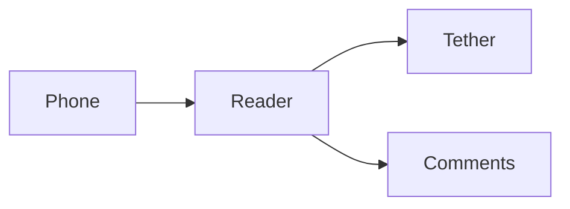

# Phone staging

This is a disposable copy. Select a passage, add a comment, open the thread drawer, and try zooming the diagram.

## A paragraph to read

The phone reader should keep this text readable at narrow widths. A long paragraph helps reveal awkward wrapping, crowded controls, and unexpected horizontal scrolling. Comments belong to this staging session only.



## Layout samples

- A short list item.
- A longer item that wraps across several lines when the viewport is narrow enough.

| Surface | What to check |
| --- | --- |
| Document | Heading, paragraphs, lists, and table wrapping |
| Comments | Selection, composer, thread drawer, and replies |
| Diagram | Zooming, panning, and legible labels |

```typescript
const phone = { reading: true, commenting: true };
console.log(phone);
```

> Scroll to this quote, add a comment, then return to the heading.
